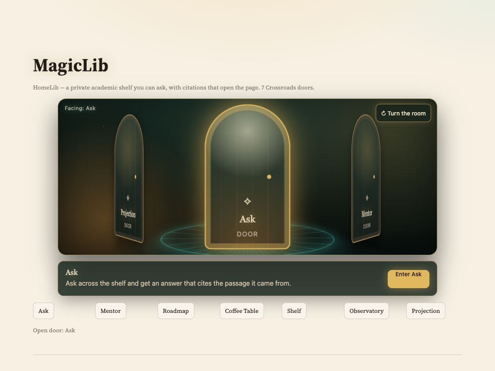
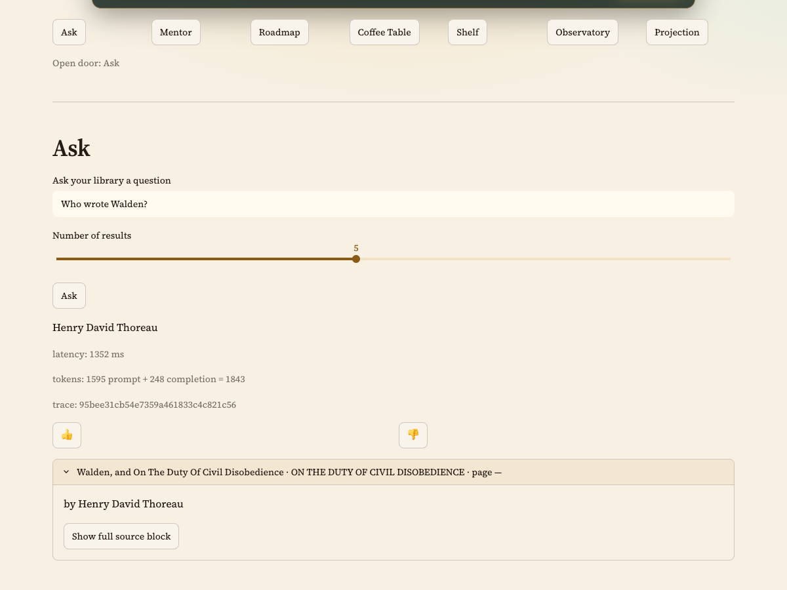
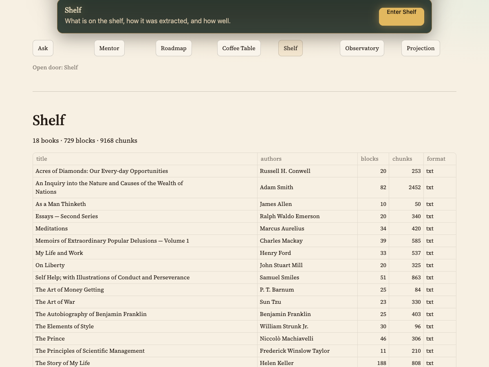
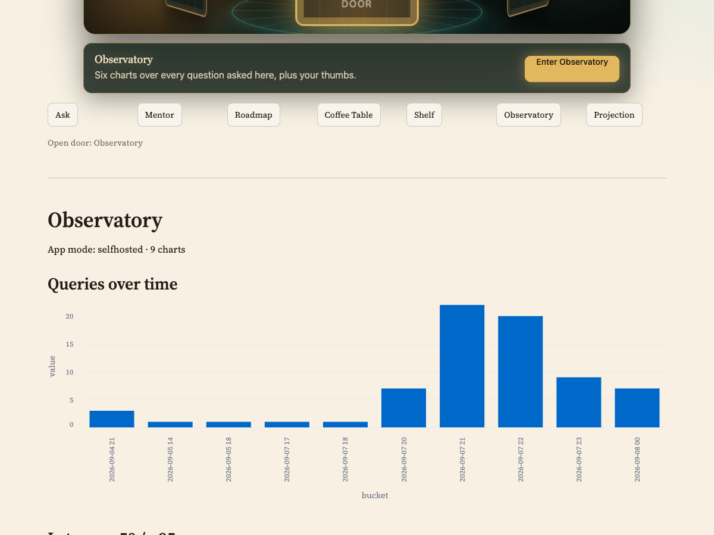
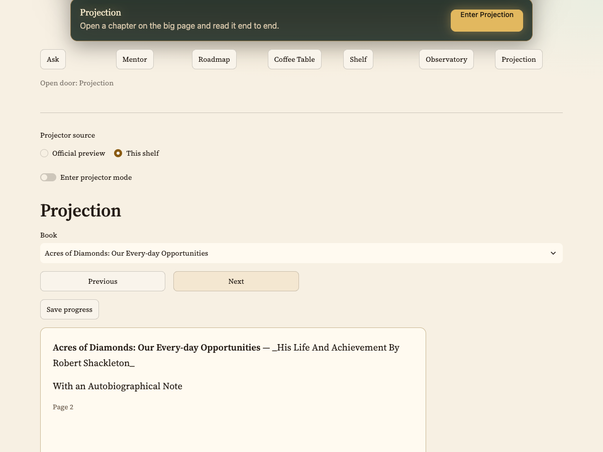
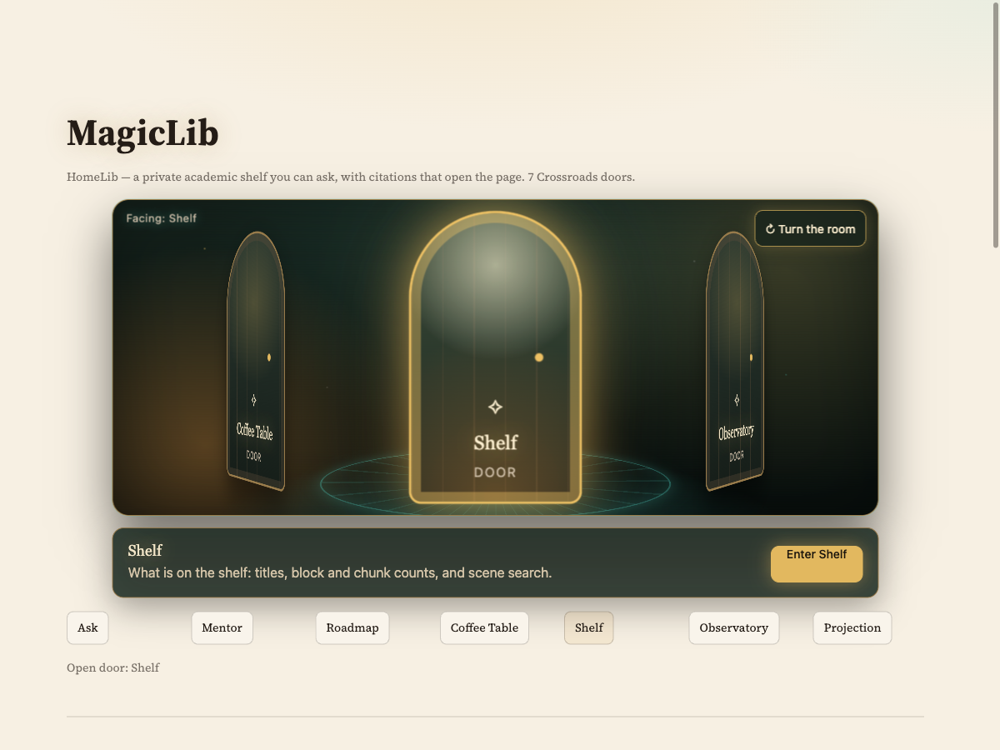
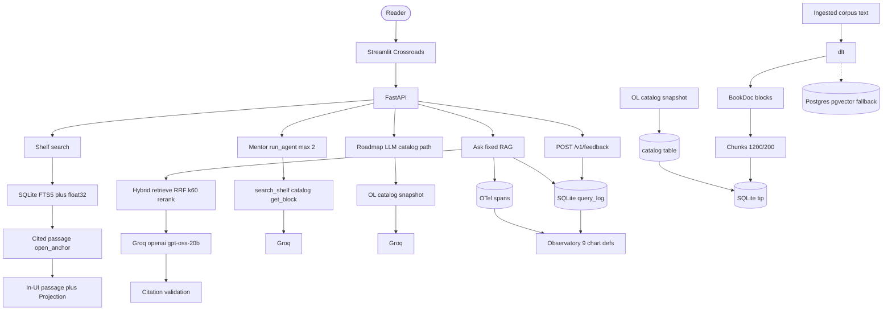

# homelib

**Live demo:** https://homelib.streamlit.app/

**Your bookshelf is unsearchable, and your reading order is unplanned.**

You own books in incompatible formats. Nothing searches across them, so a
half-remembered argument is hard to find and harder to quote with a page.
Choosing what to read next is guesswork.

**homelib** ingests the books you own (EPUB, PDF — native or scanned, TXT,
Markdown, DjVu) into one document model, then puts three things on top:

1. **Ask** — retrieval-augmented answers with **block-level citations** you can open.
2. **Roadmap / Mentor** — an ordered reading plan from catalog + shelf evidence.
3. **Shelf / Observatory** — what is ingested, and how the system behaves under load.

The tip store is **SQLite FTS5 + a float32 embedding matrix**. Generation uses
**Groq** (`openai/gpt-oss-20b`) when `GROQ_API_KEY` is set. Ollama is an optional
local fallback. Never commit an API key.

**Submission commit:** record on `main` at submit time (see [`docs/evidence.md`](docs/evidence.md)).

### DO-NOT-CLAIM

Safe when true: cited RAG on the demo shelf · citations that open a source block ·
measured eval tables in [`EVAL.md`](EVAL.md) · Streamlit Crossroads · Groq on the
public demo. See also [`TRADEOFFS.md`](TRADEOFFS.md) and [`COST-LATENCY.md`](COST-LATENCY.md).

Unsafe until measured on the submission SHA: “eval fails every PR in CI”
(`just eval-gate` exists; not yet in `just ci`) · career-planning Mentor as a
guaranteed success · “production vector DB” (tip path is SQLite).

## Try (≈15 minutes)

**Hosted (no install):** open [homelib.streamlit.app](https://homelib.streamlit.app/)

1. **Ask** → `Who wrote Walden?` → expand a citation → **Show full source block**.
2. **Shelf** → confirm ~18 books / scene search → **Open this passage**.
3. **Observatory** → charts after traffic (empty on a cold seed is expected).

**Local SQLite (same runtime as the Cloud demo):**

```bash
git clone https://github.com/elgrassa/homelib.git
cd homelib
uv python install 3.13
uv sync --frozen --all-extras
cp .env.example .env
# set GROQ_API_KEY=… and leave LLM_API_KEY blank; HOMELIB_SQLITE_PATH=data/local-demo.sqlite
uv run --frozen --env-file .env streamlit run streamlit_app.py --server.address 127.0.0.1
```

Open http://127.0.0.1:8501 — first launch inflates `data/seed/homelib.sqlite.gz`
when the target DB is missing. Docker Compose rebuilds ingestion + the full
stack: `just up && just seed && just seed-sqlite` (see below).

## What it looks like

Seven doors on one page: Ask, Mentor, Roadmap, Coffee Table, Shelf, Observatory,
Projection. Captures below are from a local Streamlit run against the seeded
shelf (not Cloud).













## System architecture



**Ask** is single-shot hybrid retrieve → rerank → Groq → citation validation.
**Mentor** alone runs `run_agent` (max 2 rounds). **Roadmap** is an LLM-assisted
catalog path. Shelf / Coffee Table / Projection do not call Groq.

Demo seed: **18 public-domain TXT books** (other parsers are tested, not in the
seed). Catalog metadata is a separate Open Library snapshot. Postgres + pgvector
remains the self-hosted fallback.

### Which LLM answers

| Edition | Model | Where it is set |
|---|---|---|
| Compose / local demo | Groq `openai/gpt-oss-20b` | `GROQ_API_KEY` in `.env` (`LLM_API_KEY` blank) |
| Optional `--profile local-llm` | Ollama `qwen2.5:7b-instruct` | `LLM_API_KEY=ollama` |
| Public Cloud demo | Groq free tier, same model | owner Streamlit Secrets; **100 LLM calls / visitor / UTC day** |

A missing model returns `degraded=true` with retrieval still shown — it does not invent citations.

```text
POST /v1/ask {"query": "Who wrote Walden?", "k": 5}
→ degraded: false · arm_used: hybrid_rerank
→ answer: Henry David Thoreau
→ citation opens GET /v1/blocks/… → 200
```

## Evaluation results

**Retrieval (SQLite tip, 2026-09-06).** 4 arms × 235 questions, k=5, 0 degraded.
**Passage** hit-rate@5 and **book** hit-rate@5 are different metrics — book hit
is not answer accuracy.

| arm | passage hit-rate@5 | book hit@5 | MRR@5 |
|---|---:|---:|---:|
| `lexical` | 0.064 | 0.077 | 0.055 |
| `vector` | 0.630 | 0.906 | 0.473 |
| `hybrid` | 0.638 | 0.906 | 0.483 |
| **`hybrid_rerank` (app)** | **0.638** | **0.906** | **0.572** |

Rerank lifts MRR with hit-rate flat. Query rewrite was measured and left **off**.
Floors: [`evals/eval-baseline.json`](evals/eval-baseline.json). Archived check:
`just eval-gate`. Live bake-off: `python evals/retrieval_eval.py` /
`python evals/llm_eval.py`. Methodology: [`EVAL.md`](EVAL.md),
[ADR-001](docs/adrs/ADR-001-retrieval-arm.md), [ADR-003](docs/adrs/ADR-003-answer-prompt.md).

**LLM prompts.** Four arms including a `production` control; judge variance can
exceed between-arm spread, so the incumbent prompt stays (ADR-003).

### Monitoring

Open the **Observatory** door (or `GET /v1/observatory`): nine chart definitions
over SQLite `query_log` + OTel spans + thumbs feedback. Judged relevance stays
empty until an operator runs `scripts/judge_recent.py` (off by default).

```bash
HOMELIB_SQLITE_PATH=data/homelib.sqlite uv run python -m scripts.demo_traffic --n 40
```

## Quickstart — Docker Compose

```bash
cp .env.example .env   # paste GROQ_API_KEY=… ; never commit
just up && just seed && just seed-sqlite
# UI http://localhost:8501 · API http://localhost:8000/docs · health: curl -fsS http://localhost:8000/health
```

Both seeds are required: Postgres for the v1 Grafana path, SQLite for the tip
API/UI. Prefer `just …` over raw compose so `--env-file` and `-p homelib` stay
correct. Details and port overrides: [`.env.example`](.env.example).

## Data

Pinned artefacts — no re-download for the demo: 18 Gutenberg texts
(`data/corpus_snapshot.jsonl.gz`) and an Open Library **metadata** catalog
snapshot (`data/catalog.jsonl`). Provenance: [`docs/data-sources.md`](docs/data-sources.md),
[`data/manifest.yaml`](data/manifest.yaml).

## Development

```bash
uv sync --all-extras
just ci      # ruff + mypy --strict + pytest, 90% coverage floor
just drill   # cold-clone reproducibility gate
```

Specs in [`specs/`](specs/); build log in [`docs/evidence.md`](docs/evidence.md).
Maintainer maps (optional): [`docs/course-map.md`](docs/course-map.md),
[`docs/zoomcamp-2026-gap-report.md`](docs/zoomcamp-2026-gap-report.md).

## Rubric self-audit

Status vocabulary in [`CHECKLIST.md`](CHECKLIST.md): `done` means verified in
[`docs/evidence.md`](docs/evidence.md), not merely “code exists.”

| Criterion | Points | Status |
|---|---:|---|
| Problem description | 2 | done |
| Retrieval flow (KB + LLM) | 2 | done |
| Retrieval evaluation | 2 | done |
| LLM evaluation | 2 | done |
| Interface (UI + API) | 2 | done |
| Ingestion (dlt) | 2 | done |
| Monitoring (≥5 charts + feedback) | 2 | done |
| Containerization | 2 | done |
| Reproducibility | 2 | done |
| Hybrid + rerank + rewrite (measured) | 3 | done |
| Cloud (bonus) | 2 | done — https://homelib.streamlit.app/ |
| Extras (bonus) | — | partial — Mentor, eval gate, Coffee Table, rotunda |

## License

Code: [PolyForm Noncommercial 1.0.0](LICENSE). Docs/screenshots:
[CC BY-NC-SA 4.0](LICENSE-docs.md). Reasoning:
[ADR-007](docs/adrs/ADR-007-licence-provisional.md). Demo corpus is public-domain
text only; Open Library is metadata, not full-text ingest.
