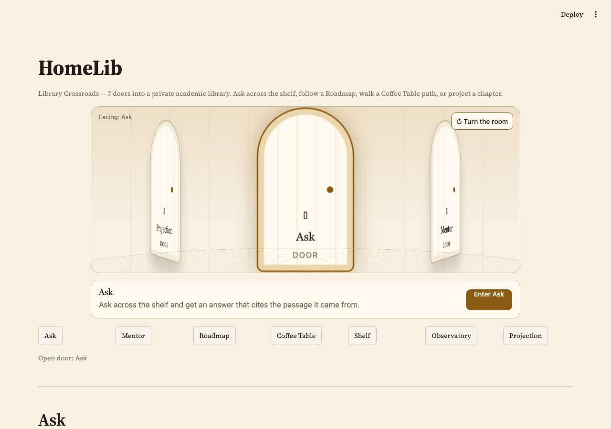
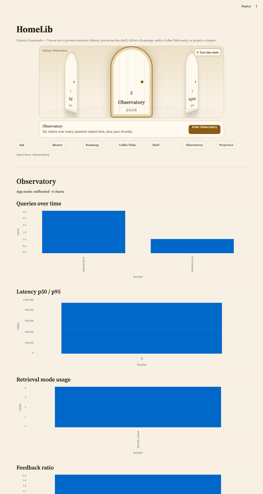

# homelib

**Your bookshelf is unsearchable, and your reading order is unplanned.**

You own books — bought, downloaded, scanned — in a pile of incompatible formats.
Nothing searches across them. When a half-remembered argument matters, you can't
find the passage, and you certainly can't quote it with a page number. And when
you want to learn something new, choosing what to read next is guesswork
performed alone.

**homelib** ingests books in any format you own (EPUB, PDF — native *or*
scanned, TXT, Markdown, DjVu) into one universal document model, then puts three
things on top of it:

1. **Ask your library** — retrieval-augmented answers where every claim carries a
   **block-level citation**: book, chapter, page. You can check the machine.
2. **Reading roadmap** — say what you want to learn ("AI engineering, LLM
   harnesses, building a software business") and an agent composes an ordered,
   justified reading plan from a book catalog.
3. **Library view** — what's ingested, how it was extracted, and how well.

Everything runs **fully self-hosted**. Compose still brings up Postgres
(full-text + pgvector), Grafana, a local LLM, the API, and the UI. When
`HOMELIB_SQLITE_PATH` is set (the tip product path), asks and feedback also
land in SQLite, and the UI's Observatory door serves ≥5 charts in-app. A cloud
API key is an optional override, never a requirement — there is nothing to sign
up for.

**Live demo:** _URL to be added after Cloud deploy_
**Submission commit:** _SHA to be added_

A screenshot of the Crossroads rotunda (the entry to the Ask door) lives in
[`docs/screenshots/crossroads-rotunda-seven-doors.png`](docs/screenshots/crossroads-rotunda-seven-doors.png)
(below); a transcript of one real cited answer is under "Which LLM answers"
in Architecture, below.

---

## What it looks like

The UI is one page — the **Library Crossroads** — with seven doors: Ask,
Mentor, Roadmap, Coffee Table, Shelf, Observatory, Projection. The rotunda
above the grid is the room you turn; the button grid beneath it is always
rendered, so navigation never depends on the animation.





Both stills are the live Streamlit UI at PR-D (`streamlit run apps/ui/app.py`
against the compose API). The HTML mockups in [`docs/mockups/`](docs/mockups/)
are design intent — the rotunda's template came from them — not a pixel match.

## Quickstart

**Prerequisites.**

- **macOS:** `brew install just uv`, plus Docker Desktop (Compose v2 ships in it).
- **Linux:** `curl -LsSf https://astral.sh/uv/install.sh | sh` for `uv`; see
  [github.com/casey/just#installation](https://github.com/casey/just#installation)
  for `just` (packaged on most distros, e.g. `apt install just`); Docker Engine
  + the `docker compose` plugin (Compose v2) from your distro or docker.com.
- Optional, only if you want to ingest your own DjVu-format books outside
  Docker: `djvulibre` (`brew install djvulibre` / `apt install djvulibre-bin`)
  — the ingest container already has it baked in.
- `just ci` enforces a 90% test-coverage floor (`pyproject.toml`); a PR that
  drops below it fails locally before it ever reaches CI.

```bash
cp .env.example .env
docker compose -p homelib --env-file .env -f docker/docker-compose.yml up -d --build
docker compose -p homelib --env-file .env -f docker/docker-compose.yml --profile seed run --rm ingest
docker compose -p homelib --env-file .env -f docker/docker-compose.yml --profile seed run --rm ingest python -m apps.ingest.sqlite_pipeline
open http://localhost:8501
```

The two seed lines are not a typo. The first loads Postgres (the v1 store the
Grafana dashboard reads); the second loads the **SQLite** file the API and the
Crossroads doors actually read (ADR-004). Until the second one has run,
`/health` returns HTTP 200 with `"status": "degraded"` and `"books": 0` — the
file exists because SQLite creates it on first connect, and that emptiness is
made loud on purpose.

Neither flag is optional, and both exist because the compose file lives in
`docker/`:

- `--env-file .env` — Compose treats `docker/` as the project directory and
  looks for `docker/.env`, so without this it starts Postgres with a blank
  password. It warns rather than failing, so the stack boots misconfigured.
- `-p homelib` — Compose otherwise names the project after that same
  directory, i.e. `docker`. That collides with any other project on your
  machine laid out the same way, and it means a Docker restart can bring the
  stack back attached to a different, empty volume while the seeded one sits
  untouched. Both observed here.

`just up && just seed && just seed-sqlite` does all of this for you and refuses
to run without a `.env`, which is the recommended path.

Ports (`API_PORT`, `UI_PORT`, `READ_PORT`, `GRAFANA_PORT`, `POSTGRES_PORT`,
`OLLAMA_PORT`) are overridable in `.env` if something already listens on a
default, as is the bind address (`HOMELIB_UI_BIND`).

| Service | Default | What it is |
|---|---|---|
| UI | http://localhost:8501 | Streamlit: Crossroads doors (Ask, Mentor, Shelf, Observatory, …) |
| Clean read (companion) | http://localhost:8502/read/{book_id} | Chrome-free article for Safari Listen to Page; same container as the UI |
| API | http://localhost:8000/docs | FastAPI + Swagger — the full contract |
| Grafana | http://localhost:3001 | v1 dashboard, 6 panels over the **Postgres** `query_log` — empty on the tip path, see below |

**LAN / projector (optional).** `HOMELIB_UI_BIND=0.0.0.0` in `.env` publishes
the UI and the companion on your home network (default is loopback).
`HOMELIB_OFFICIAL_VIEWER=1` additionally enables the display-only two-page
viewer for publisher previews; it is off by default and is never used by the
public demo.

**Reviewer notes.** Monitoring is the in-app **Observatory** door
(`GET /v1/observatory`, six charts + thumbs feedback) — that is the v2 surface
and the one `just drill` asserts on ([ADR-005](docs/adrs/ADR-005-observatory-replaces-grafana.md)).

- With `HOMELIB_SQLITE_PATH` set (the compose default and the tip path) every
  ask and feedback row lands in SQLite. Grafana reads the Postgres `query_log`,
  which this path never writes, so its panels stay **empty** — it is not
  a second view of the same data.
- Grafana only populates when the API runs with `HOMELIB_SQLITE_PATH` unset
  (the v1 Postgres path, tag `v1-fallback`). It stays in compose until the
  Observatory has been green through a drill; removing it is tracked, not done.

### Run without Docker (SQLite-only)

This is the exact runtime the public Streamlit demo uses: the committed
SQLite seed (FTS5 for lexical search, plus a float32 embedding matrix for
vector search — no Postgres, no pgvector) is inflated once, retrieval runs
locally and sub-second, and the only network call made at request time is to
the LLM.

```bash
uv sync --all-extras

# Inflate the committed seed once (same bytes the Streamlit Cloud demo
# inflates on cold start — see apps/inprocess_bridge.py).
mkdir -p data && gunzip -k -c data/seed/homelib.sqlite.gz > data/homelib.sqlite

export HOMELIB_SQLITE_PATH=data/homelib.sqlite
export APP_MODE=demo
unset DATABASE_URL
export LLM_BASE_URL=http://localhost:11434/v1   # local Ollama by default
export LLM_MODEL=qwen2.5:7b-instruct
export LLM_API_KEY=ollama

uv run --frozen uvicorn apps.api.main:app --host 127.0.0.1 --port 8000 &
curl -fsS http://127.0.0.1:8000/health
curl -fsS -X POST http://127.0.0.1:8000/v1/ask \
  -H 'Content-Type: application/json' \
  -d '{"query": "Who wrote Walden?", "rewrite": false, "k": 3}'
```

[`scripts/sqlite_only_smoke.sh`](scripts/sqlite_only_smoke.sh) runs this exact
shape as an automated check (same env vars, port 18011 by default) and also
proves a minted Coffee Table session persists across calls while a
header-less request stays anonymous.

---

## Architecture

```
     EPUB / PDF / scanned PDF / TXT / MD / DjVu
                      │
              parse_file()  ── per-format handlers, each returning an
                      │        ExtractionResult (native_text | ocr_fallback
                      │        | mixed) with a sha256 of what it extracted
                      ▼
                  BookDoc  ── ordered Blocks; every Block carries
                      │        section_path + char offsets + provenance
                      │        (PDF page / EPUB spine index + anchor)
                      ▼
              chunk_book()  ── block-aware, sentence-boundary chunks;
                      │        canonical_text[start:end] == text, exactly
                      ▼
        dlt pipeline ──────► Postgres
                               ├── chunks + tsvector (GIN)      lexical
                               ├── chunk_embeddings vector(384) semantic
                               ├── catalog (Open Library)       roadmap
                               └── query_log                    monitoring
                                        │
              ┌─────────────────────────┼─────────────────────────┐
              ▼                         ▼                         ▼
      lexical / vector           RRF hybrid (k=60)          cross-encoder
       search arms                                             rerank
              └─────────────────────────┬─────────────────────────┘
                                        ▼
                         agent loop (function calling)
                    search_shelf · search_catalog · build_roadmap · get_block
                                        │
                                        ▼
                       answer with block-level citations
```

The **UI never touches the database.** It talks only through the public API, so
the API stays the single contract — and the Swagger page is the documentation.

### Which LLM answers

One OpenAI-compatible client, three `LLM_*` variables, no provider chain:

| Edition | `LLM_BASE_URL` / `LLM_MODEL` | Where it is set |
|---|---|---|
| Compose (`just up`) | Ollama in the stack, `qwen2.5:7b-instruct` | `docker/docker-compose.yml` defaults; `.env` overrides |
| Local `streamlit run` / tests | any local Ollama or LM Studio endpoint | `.env` |
| Public demo (Streamlit Community Cloud, owner-deployed) | Groq free tier, `llama-3.3-70b-versatile` | **owner's** Streamlit Secrets only — one secret, `GROQ_API_KEY`, is enough (with `LLM_API_KEY` blank the client falls back to Groq); the key is never in the tree (`.env.example` shows the shape) |

A missing or unreachable model never fabricates: the answer comes back
`degraded=true` with the retrieval still shown.

One real ask, SQLite-only edition (`DATABASE_URL` unset, `APP_MODE=demo`,
local Ollama `qwen2.5:7b-instruct`, 2026-09-05, `scripts/sqlite_only_smoke.sh`):

```text
POST /v1/ask {"query": "Who wrote Walden?", "k": 3}
→ degraded: false · arm_used: hybrid_rerank · latency_ms: 35857
→ answer: Henry David Thoreau
→ citation 1: "Walden, and On The Duty Of Civil Disobedience", block 25a30321b30d03cc
GET /v1/blocks/25a30321b30d03cc → 200 (the citation opens)
```

## Evaluation results

**Retrieval on the tip store — SQLite FTS5 + float32 matrix (measured
2026-09-03).** 4 arms × 235 ground-truth questions, k=5, **0 degraded across
all 940 arm-runs**. This is the store the product reads when
`HOMELIB_SQLITE_PATH` is set, and the one `just ci` gates against
([`evals/eval-baseline.json`](evals/eval-baseline.json), margin 0.01).

| arm | hit-rate@5 | MRR@5 | mean latency |
|---|---:|---:|---:|
| `lexical` | 0.064 | 0.055 | 12 ms |
| `vector` | 0.630 | 0.473 | 45 ms |
| `hybrid` | 0.638 | 0.483 | 11 ms |
| **`hybrid_rerank`** | **0.638** | **0.572** | 68 ms |

On this store the vector arm carries retrieval and fusion adds a little on
top (0.630 → 0.638). Rerank leaves hit-rate flat and lifts MRR 0.483 → 0.572
— the reranker signature: it reorders a fixed candidate set, it cannot
retrieve what fusion did not surface. Two bugs had to be fixed before this
table was trustworthy — embeddings were stored as float32 BLOBs but decoded as
JSON (vector arm 100% degraded), and the FTS5 query AND-required stopwords
unlike Postgres `plainto_tsquery` — each with a named regression test
([ADR-001 §v2](docs/adrs/ADR-001-retrieval-arm.md)). Do **not** read the
vector jump against the Postgres run below (0.106 → 0.630) as a model or
chunker win: the stores, index approximation and encoding all differ, and a
matched re-run on both stores is an open item. Production runs
`hybrid_rerank`; query rewrite stays off.

**Retrieval on the v1 store — Postgres FTS + pgvector (measured 2026-08-30,
kept for the record).** Same 235 questions, k=5, 0 degraded.

| arm | hit-rate@5 | MRR@5 |
|---|---:|---:|
| `lexical` | 0.072 | 0.066 |
| `vector` | 0.106 | 0.092 |
| `hybrid` | 0.174 | 0.152 |
| **`hybrid_rerank`** | **0.174** | **0.167** |

There, fusion was where the gain was: hybrid beat the better single arm by
+64% (0.174 vs 0.106) because lexical and vector failed on different
questions, and rerank lifted MRR (0.152 → 0.167) with hit-rate flat. Query
rewriting was measured on a matched 80-row sample and **rejected**:
0.150/0.144 hit-rate/MRR with rewrite off vs. 0.150/0.138 with it on — a
recorded negative result, not an oversight. Because 0.174 read low, a
60-question proximity probe asked not "was the labelled chunk retrieved" but
"was anything near it retrieved": exact-chunk hit-rate 0.133, the **correct
book** in the top-5 65.0% of the time and the **correct section** 40.0%,
across 18 books (chance 5.6%). The metric is single-positive and chunk-exact,
so a neighbouring chunk with equally relevant prose scores as a total miss;
that understates usefulness, and 0.650 book-level accuracy is not a good
absolute score either. Full reasoning in
[ADR-001](docs/adrs/ADR-001-retrieval-arm.md).

**LLM answer quality.** 4 prompt arms — 3 challengers plus the production
prompt as a control — × 30 questions, scored by an LLM judge with bias
control. **Null result:** run-to-run variance (spread up to 0.47 across four
repeated runs) exceeded the entire between-arm spread within a single run
(0.34), and the ranked winner flipped between runs, so the incumbent prompt
stays. A hedging guard also flagged the top-scoring arm (`stepwise`) as
**unproven**: it declined to cite anything more often than any other arm
(7/30 questions), and a zero-citation decline still counts as a success, so
an arm that hedges has less for a judge with almost no dynamic range to mark
down. This is stated as the honest outcome it is, not a failure to hide —
the eval infrastructure (judge, bias control, hedging guard) worked exactly
as designed; the measured difference between prompts is below its noise
floor. Full reasoning in [ADR-003](docs/adrs/ADR-003-answer-prompt.md).

**Regression gate.** Both evals have measured baselines with margins in
[`evals/eval-baseline.json`](evals/eval-baseline.json), an append-only run
history, and a rule that a metric missing from a run counts as a regression
rather than being silently skipped.

### Run the evaluations

```bash
just eval-retrieval   # 4 arms x 235 questions -> evals/results/retrieval.md
just eval-llm         # 4 prompt arms x 30 questions, judge-scored -> evals/results/llm_eval.md
just eval             # both, in sequence
```

Set `HOMELIB_SQLITE_PATH` first to run these against the SQLite tip store
(the one the tables above and `evals/eval-baseline.json` gate on); leave it
unset to run against Postgres instead. Full numbers and methodology:
[`evals/results/retrieval.md`](evals/results/retrieval.md),
[`evals/results/llm_eval.md`](evals/results/llm_eval.md).

### See the monitoring dashboard

```bash
HOMELIB_SQLITE_PATH=data/homelib.sqlite uv run python scripts/demo_traffic.py --n 40
```

Then open the UI and turn the rotunda to the **Observatory** door (or call
`GET /v1/observatory` directly) for six charts over the SQLite `query_log`
plus thumbs-up/down feedback on every answer. On a freshly seeded store the
charts are empty — that is expected, not a bug; `demo_traffic.py` above (or
a real round of `/v1/ask`) is what fills them. Feedback recorded through the
thumbs buttons (`POST /v1/feedback`) feeds the same charts as the synthetic
traffic.

## Data

Two sources, both committed as pinned artefacts so a reviewer never has to
re-download anything. **Project Gutenberg** (dataset) — 18 public-domain
books (Franklin, Adam Smith, Taylor, Ford, Thoreau, Mill, Strunk and others),
each pinned in `data/manifest.yaml` by exact source URL and a sha256 computed
from a real download; parsed into 729 blocks / 9,168 chunks and committed as
`data/corpus_snapshot.jsonl.gz` (6 MB). **Open Library Search API**
(API-backed source) — 3,061 deduplicated works gathered across 14
roadmap-relevant subjects, committed as `data/catalog.jsonl`; Internet
Archive asserts no rights over this metadata. Two other candidate sources
(Kaggle's "15K+ Books" and the Google Books API / UCSD Goodreads graph) are
deliberately excluded on licensing grounds, and personal purchased ebooks
stay local and git-ignored — only public-domain text is committed.

See [`docs/data-sources.md`](docs/data-sources.md) for the full page: every
source at a glance, per-book provenance, model pins, and diagrams of how each
one is fetched and consumed.

## Development

```bash
uv sync --all-extras
just ci      # ruff + mypy --strict + pytest, 90% coverage floor
just drill   # cold-clone reproducibility gate
```

Work is spec-first: every component has a one-page spec in [`specs/`](specs/)
written before its code, naming the data contract, the degradation behaviour,
and the tests it mandates. [`docs/evidence.md`](docs/evidence.md) is the build
log — including the defects found along the way and one diagnosis I got wrong
and had to retract.

Developer architecture docs (v2 wiki): [`docs/wiki/README.md`](docs/wiki/README.md).

`.forgejo/` holds this project's CI workflows for the private Forgejo
instance it is developed on, `CLAUDE.md`/`AGENTS.md` are agent operating
instructions, and `graphify-out/` is a generated code graph used by the
maintainer's own tooling — all three are read-only from a reviewer's
perspective and safe to ignore.

## Course map

[`docs/course-map.md`](docs/course-map.md) maps every LLM Zoomcamp 2026 module to
where this project demonstrates it, with honest per-row status.

## Rubric self-audit

Mirrors [`CHECKLIST.md`](CHECKLIST.md) section A, the current graded status
against the LLM Zoomcamp 2026 rubric. Status vocabulary is deliberately
strict there: `done` means verified by a command whose output is recorded in
[`docs/evidence.md`](docs/evidence.md), not "the code exists."

| Criterion | Points | Status | Evidence |
|---|---:|---|---|
| Problem description | 2 | done | Stated in user terms above — unsearchable shelf, unplanned reading order |
| Retrieval flow (KB + LLM) | 2 | done | Postgres FTS + pgvector + grounded, citation-validated answers — [`packages/homelib-rag`](packages/homelib-rag), [`apps/api/main.py`](apps/api/main.py) |
| Retrieval evaluation | 2 | done | 4 arms × 235 questions, 0 degraded, on both stores (SQLite 2026-09-03 is the gated one) — [`evals/results/retrieval.md`](evals/results/retrieval.md), [ADR-001](docs/adrs/ADR-001-retrieval-arm.md) |
| LLM evaluation | 2 | done | 4 prompt arms × 30 questions, judge with bias control; null result recorded — [`evals/results/llm_eval.md`](evals/results/llm_eval.md), [ADR-003](docs/adrs/ADR-003-answer-prompt.md) |
| Interface (UI or API) | 2 | done | Both — FastAPI (18 paths, OpenAPI-pinned) and the Streamlit Crossroads: **seven doors** behind the rotunda, static grid always rendered — [`apps/api/main.py`](apps/api/main.py), [`apps/ui`](apps/ui), [`specs/ui.md`](specs/ui.md) |
| Ingestion pipeline (e.g. dlt) | 2 | done | Real dlt source/resources, ELT into the canonical schema, 37 tests against a live Postgres — [`apps/ingest/pipeline.py`](apps/ingest/pipeline.py) |
| Monitoring (feedback + ≥5-chart dashboard) | 2 | done | Observatory door: 6 charts over SQLite `query_log` + thumbs feedback, asserted by `just drill`; Grafana (Postgres) is the v1 surface and is empty on the tip path — [ADR-005](docs/adrs/ADR-005-observatory-replaces-grafana.md), [`docs/evidence.md`](docs/evidence.md) |
| Containerization | 2 | done | 7 services in one compose file, digest-pinned, healthchecked — [`docker/docker-compose.yml`](docker/docker-compose.yml) |
| Reproducibility | 2 | done | Pins, snapshot, digests; **`just drill` PASSED on the train tip `ee0f318`** (2026-09-05 22:01, ~68 min at host load 200–440: cold clone from `.env.example`, `--build` Postgres seed 18 books, `--build` SQLite seed 18/729/9168/9168, `/health` ok 18/9168, ask attempt 1 timed out at 300 s, **attempt 2 grounded `hybrid_rerank` with a resolving citation**, Observatory 6 charts / 5 populated, `queries_over_time` 1 point). Earlier: PASSED on `v2` @ `d6f9946` (2026-09-04); the 2026-09-05 re-run on `ae83d51` passed clone/seeds/health and failed the ask step under host load (3/5 timeouts) — recorded, not hidden — [`docs/evidence.md`](docs/evidence.md), [`scripts/cold_clone_drill.sh`](scripts/cold_clone_drill.sh) |
| Best practices — hybrid (1) + rerank (1) + rewrite (1) | 3 | done | All three implemented **and** measured. Rewrite's evaluation rejected it on evidence — under the course's own "if implemented and evaluated" rule, the measurement is the point earned, not a passing score — [ADR-001](docs/adrs/ADR-001-retrieval-arm.md) |
| Cloud deployment (bonus) | 2 | not done | No public URL from this tree. The Cloud files (root `streamlit_app.py`, committed seed, Python 3.13 in Advanced settings, Groq secrets) are drafted and held until the drill re-run passes; the Streamlit Community Cloud app is created after this snapshot merges — [`docs/submission.md`](docs/submission.md) |
| Extras (bonus) | 1 | partial | Mentor agent with abstention, eval regression gate with an append-only history, Coffee Table state machine, the rotunda — the reviewer's call |

Floor without any bonus, on the statuses above: **21/21** done, with row 9
flagged for a quiet-box drill re-run. See `CHECKLIST.md` for the
engineering-quality checklist behind this table.

**Public demo URL:** none yet — see "Live demo" at the top of this README
(bonus row above).
**Submission commit:** to be recorded in [`docs/evidence.md`](docs/evidence.md)
at submission time (see "Submission commit" at the top of this README).

## License

Code is licensed under [PolyForm Noncommercial 1.0.0](LICENSE); docs, images
and screenshots (README, `docs/`, `docs/mockups/`, `docs/screenshots/`) under
[CC BY-NC-SA 4.0](LICENSE-docs.md). Free for personal and non-commercial use;
no commercial use. Reasoning in
[ADR-007](docs/adrs/ADR-007-licence-provisional.md).

Demo corpus is public-domain text only; catalog metadata from Open Library.
Per-source provenance in [`data/manifest.yaml`](data/manifest.yaml).
