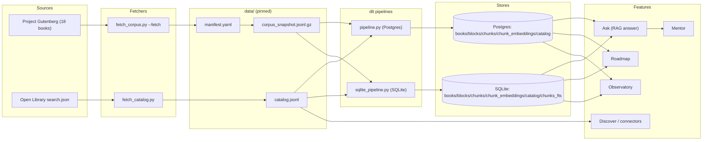
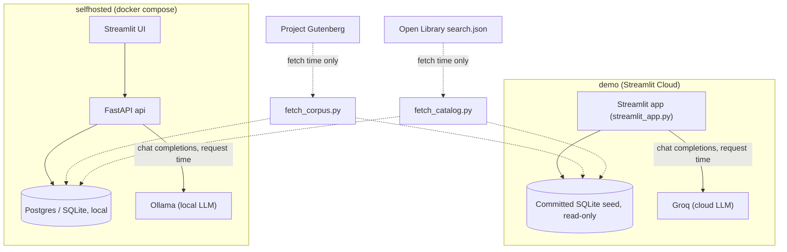
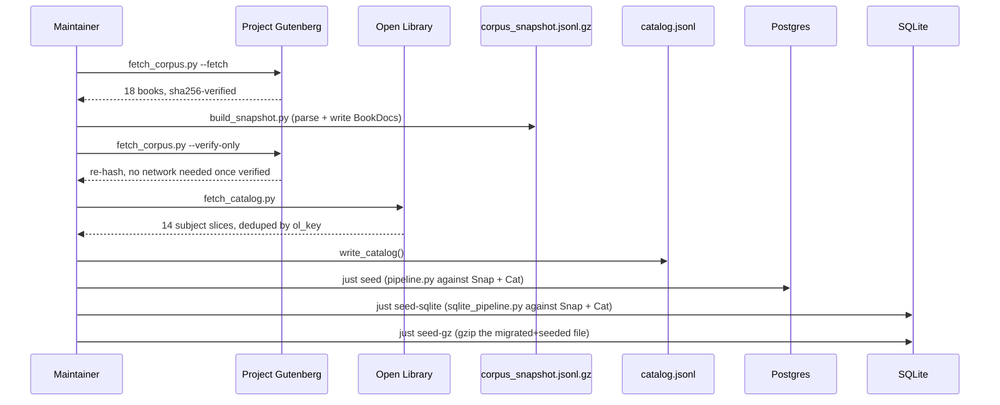

# Data sources: datasets, APIs and models

This page is written for a reviewer who did not take the course and is cloning the repo cold. Every number below is cited to a repo file and comes with the command that reproduces it (§11).

## 1. What this project is built on

In the rubric's own terms, HomeLib has one **dataset** and one **API-backed source**. The dataset is Project Gutenberg: 18 public-domain books, each pinned as an exact plain-text mirror URL with a verified sha256 hash. The API-backed source is the Open Library Search API (`search.json`), queried across 14 curated subjects to build a 3,061-work catalog used by the roadmap/recommendation feature. Both are committed into the repository as pinned artefacts — the book corpus as a gzipped JSONL snapshot, the catalog as a plain JSONL file — so the whole pipeline is reproducible **offline**: a reviewer never has to re-download anything to rebuild the demo. The Streamlit demo itself runs on a committed SQLite seed file (FTS5 for lexical search plus a float32 embedding matrix for vector search), so retrieval is local and sub-second; the only network call made at request time is to the LLM — Groq on Streamlit Community Cloud, or a local Ollama instance when self-hosted.

Source: `README.md` ("Data", "Architecture", "Which LLM answers" sections); `specs/corpus.md`; `docs/adrs/ADR-002-catalog-source.md`.

## 2. At a glance

| Source | Kind | What we take | Rights | Fetched by | Pinned artefact | Consumed by |
|---|---|---|---|---|---|---|
| Project Gutenberg | dataset | Full plain-text of 18 books | `public_domain` | `apps/ingest/fetch_corpus.py --fetch` | `data/manifest.yaml` (pins), `data/corpus_snapshot.jsonl.gz` (6.0 MB) | `apps/ingest/pipeline.py`, `apps/ingest/sqlite_pipeline.py` → Postgres/SQLite `books`/`blocks`/`chunks` |
| Open Library Search API | API | Title/authors/subjects/year for works matching 14 subjects | Metadata, no rights asserted (Internet Archive) | `apps/ingest/fetch_catalog.py` | `data/catalog.jsonl` (3,061 entries + provenance header) | `catalog` table; `search_catalog` agent tool; roadmap feature |
| Lawful connectors (Open Library / Standard Ebooks / Gutenberg) | derived / fixture | Federated "Discover" search hits, deduped with attribution | Per-hit `rights_status` | `packages/homelib-rag/src/homelib_rag/connectors.py` (fixture-backed in CI; live Open Library allowed outside CI) | JSONL fixtures under `data/`/test dirs | Discover / Mentor catalog tools |
| Pottermore Publishing (metadata preview) | metadata-only, **not ingested** | Title/author/reader-URL/PDF-URL for 7 Ukrainian Harry Potter ebooks | `metadata_only`, `can_index_text: false` | manual fixture | `apps/ui/fixtures/pottermore_uk_hp_preview.json` | UI preview only — links, never indexed |
| `sentence-transformers/all-MiniLM-L6-v2` | model | 384-dim sentence embeddings | Open model weights | loaded in `api`/`ingest` process | pinned model name in code | `homelib_rag.index`, `homelib_rag.sqlite_index`, `apps/ingest/pipeline.py` |
| `cross-encoder/ms-marco-MiniLM-L-6-v2` | model | (query, chunk) relevance re-scoring | Open model weights | loaded lazily in `api` process | pinned model name in code | `homelib_rag.rerank` |
| Ollama (local LLM) | provider | Chat completions, `qwen2.5:7b-instruct` default | Local, no data leaves the host | `docker/docker-compose.yml` service | `LLM_*` env vars | `homelib_rag.answer.OpenAIClient`, `rewrite.py`, `evals/ground_truth.py` |
| Groq (cloud LLM) | provider | Chat completions, `llama-3.3-70b-versatile` default | Owner's Streamlit secret only | Streamlit Community Cloud | `GROQ_API_KEY` (owner-only secret) | `homelib_rag.answer.OpenAIClient` (public demo only) |
| Ground-truth questions | derived | 235 `question -> chunk_id` pairs for retrieval eval | Generated, not scraped | `evals/ground_truth.py` (LLM-generated from the committed corpus) | `evals/ground_truth.jsonl` | `evals/retrieval_eval.py` |
| SQLite seed | derived | Books/blocks/chunks/embeddings/catalog, pre-built | Same rights as source rows | `just seed-gz` (gzips a migrated+seeded `homelib.sqlite`) | `data/seed/homelib.sqlite.gz` (28.7 MB / ~27.4 MiB) | Streamlit demo, cold-clone drill |
| Corpus snapshot | derived | Parsed `BookDoc`s, one per book | Same rights as source rows | `apps/ingest/build_snapshot.py` | `data/corpus_snapshot.jsonl.gz` (6.0 MB) | `apps/ingest/pipeline.py`, `apps/ingest/sqlite_pipeline.py`, `evals/ground_truth.py` |
| Eval history | derived | Append-only run history + baseline margins | n/a | `evals/gate.py` | `evals/eval-baseline.json`, `evals/history.jsonl` | CI regression gate (`just ci`) |

Source: `specs/corpus.md`; `specs/connectors.md`; `docs/adrs/ADR-002-catalog-source.md`; `apps/ui/fixtures/pottermore_uk_hp_preview.json`; `packages/homelib-rag/src/homelib_rag/{index.py,sqlite_index.py,rerank.py,answer.py}`; `README.md` ("Which LLM answers"); `evals/eval-baseline.json`.

## 3. The Shelf: Project Gutenberg

18 books, chosen for an engineering/business/self-education reading narrative. Each row of `data/manifest.yaml` is one book:

| book_id | title | author | Gutenberg # | language |
|---|---|---|---|---|
| `franklin-autobiography` | The Autobiography of Benjamin Franklin | Benjamin Franklin | 148 | en |
| `taylor-scientific-management` | The Principles of Scientific Management | Frederick Winslow Taylor | 6435 | en |
| `smith-wealth-of-nations` | An Inquiry into the Nature and Causes of the Wealth of Nations | Adam Smith | 3300 | en |
| `machiavelli-the-prince` | The Prince | Niccolò Machiavelli | 1232 | en |
| `suntzu-art-of-war` | The Art of War | Sun Tzu | 132 | en |
| `aurelius-meditations` | Meditations | Marcus Aurelius | 2680 | en |
| `allen-as-a-man-thinketh` | As a Man Thinketh | James Allen | 4507 | en |
| `smiles-self-help` | Self Help; with Illustrations of Conduct and Perseverance | Samuel Smiles | 935 | en |
| `washington-up-from-slavery` | Up from Slavery: An Autobiography | Booker T. Washington | 2376 | en |
| `keller-story-of-my-life` | The Story of My Life | Helen Keller | 2397 | en |
| `conwell-acres-of-diamonds` | Acres of Diamonds: Our Every-day Opportunities | Russell H. Conwell | 368 | en |
| `barnum-art-of-money-getting` | The Art of Money Getting | P. T. Barnum | 8581 | en |
| `mackay-extraordinary-popular-delusions` | Memoirs of Extraordinary Popular Delusions — Volume 1 | Charles Mackay | 636 | en |
| `strunk-elements-of-style` | The Elements of Style | William Strunk Jr. | 37134 | en |
| `emerson-essays-second-series` | Essays — Second Series | Ralph Waldo Emerson | 2945 | en |
| `mill-on-liberty` | On Liberty | John Stuart Mill | 34901 | en |
| `thoreau-walden` | Walden, and On The Duty Of Civil Disobedience | Henry David Thoreau | 205 | en |
| `ford-my-life-and-work` | My Life and Work | Henry Ford | 7213 | en |

Gutenberg # is read off the `source_url` (e.g. `.../cache/epub/148/pg148.txt` → 148).

Source: `data/manifest.yaml` (18 `book_id` entries, verified by `grep -c "^- book_id:" data/manifest.yaml`).

**How each book is pinned.** Every manifest row carries `source_url` (the exact plain-text mirror), `sha256` (computed from a real download on 2026-08-30, not a placeholder), `license_note` ("Public domain (US) — Project Gutenberg, no cost/restriction"), and `rights_status: public_domain`. `apps/ingest/fetch_corpus.py --fetch` downloads each URL, hashes the response, and refuses to write anything to disk on a mismatch — one bad mirror does not block the rest of the shelf. `--verify-only` re-hashes whatever is already on disk (or, on a fresh clone with no raw downloads, reads the committed snapshot directly) and never touches the network.

**Boilerplate stripping.** `strip_gutenberg_boilerplate()` cuts everything before the line containing `*** START OF THE PROJECT GUTENBERG EBOOK` and after the line containing `*** END OF THE PROJECT GUTENBERG EBOOK` (case-insensitive), so Gutenberg's license text never pollutes retrieval. Covered by `test_gutenberg_boilerplate_stripped` (`apps/ingest/tests/test_fetch_corpus.py:75`).

**User-Agent policy.** Both fetch scripts send `homelib-ingest/0.1 (+https://github.com/elgrassa/homelib)` — the project name and repo URL, no personal contact data (`test_user_agent_has_no_email`, `apps/ingest/tests/test_user_agent.py`).

Source: `specs/corpus.md`; `apps/ingest/fetch_corpus.py` (`USER_AGENT`, `strip_gutenberg_boilerplate`, `run_fetch`/`run_verify`, `--fetch`/`--verify-only` CLI flags).

## 4. The Catalog: Open Library Search API

Endpoint: `https://openlibrary.org/search.json`, queried once per subject as `q=subject:"<subject>"` with `fields=key,title,author_name,subject,first_publish_year` — never the ~4 GB Open Library works dump.

The 14 subjects (`CATALOG_SUBJECTS` in `apps/ingest/fetch_catalog.py`): machine learning, software engineering, entrepreneurship, management, distributed systems, deep learning, data engineering, product management, technical writing, system design, algorithms, data science, personal finance, statistics.

**Paging.** `PAGE_SIZE = 100`, `MAX_PAGES_PER_SUBJECT = 3` (so at most 300 results are requested per subject), a page stops early once a response returns fewer than `PAGE_SIZE` docs, and `REQUEST_SLEEP_SECONDS = 0.5` between requests. A failing page retries up to `MAX_ATTEMPTS = 3` times with exponential backoff, then the run moves on to the next subject rather than aborting.

**Dedup key.** Entries are deduplicated by Open Library's own work key (`ol_key`, the `key` field on each search hit) via a `dict.setdefault` — the first hit for a given key wins.

**Provenance header.** `data/catalog.jsonl`'s first line is not a `CatalogEntry`; it is a JSON object of the form `{"_provenance": "Open Library search.json, curated subject slices, fetched <date>"}`, and every loader that reads the file skips lines starting with `_provenance`.

**What becomes a `CatalogEntry`.** `ol_key`, `title`, `authors` (from `author_name`), `subjects` (from `subject`), `first_publish_year`, `description` (always `None` — `search.json` does not return descriptions; recorded as a known, accepted cost in ADR-002), and a `provenance_note` naming the subject slice and fetch date. A doc missing `key` or `title` is skipped.

**Rate/UA/cache guidance (specs/connectors.md), for a future live connector.** Identify with a `User-Agent` carrying a real contact; rate-limit to ≤1 request/s unidentified or ≤3 request/s identified, one request in-flight, exponential backoff on 429/5xx; cache responses on disk for 24h keyed by normalized query, with the seed DB staying primary so the demo never depends on Open Library being up; never bulk-harvest through the search API; fall back to the fixture catalog with a visible "live catalog unavailable" note on any error. The capstone's shipped connector federates the fixture catalog only — a live Open Library connector is planned, not built, for this submission.

**Rights.** Internet Archive (which runs Open Library) asserts no rights over this bibliographic metadata and publishes it for reuse — this is the basis of ADR-002's decision to use it.

Source: `apps/ingest/fetch_catalog.py` (`CATALOG_SUBJECTS`, `PAGE_SIZE`, `MAX_PAGES_PER_SUBJECT`, `REQUEST_SLEEP_SECONDS`, `_doc_to_entry`, `write_catalog`); `specs/connectors.md`; `docs/adrs/ADR-002-catalog-source.md`.

## 5. Banned sources and why

Recorded so a future session does not quietly reintroduce them — not advisory, grep-enforced.

- **Kaggle "15K+ Books Across 100+ Categories"** — banned in any form (committing the CSV, a build-time `kagglehub` download, or using only "harmless" fields like title/author). The dataset's own description states it was scraped from the Google Books API; Google's API Terms of Service bar scraping, derivative databases, permanent copies, and redistribution, and an uploader's CC0 badge cannot re-license data that was never theirs to relicense.
- **Google Books API directly** — same clauses one step earlier in the chain: no scraping, no derivative database, no redistribution of results.
- **UCSD Goodreads Book Graph** — its terms restrict use to non-commercial academic research and forbid redistribution; this project is neither.
- **Anna's Archive, Sci-Hub, LibGen** — added at ADR-008 (rights gate): copyright-infringing full-text sources, banned outright regardless of any licensing-fiction argument.
- **DataTalks.Club course FAQ corpus** — also named as banned in ADR-008 (a different class of reason: not this project's own content to redistribute as its dataset).

Enforcing tests (grep-based, so a re-introduction fails CI, not just a documentation reader):

- `test_kaggle_source_absent_from_pipeline` — `apps/ingest/tests/test_fetch_catalog.py:186` — greps `apps/ingest` for `import kaggle`, `from kaggle`, `kaggle.com`, `kagglehub`, or a filename containing "kaggle".
- `test_banned_sources_absent_from_ingest` — `apps/ingest/tests/test_sqlite_ingest.py:196` — greps `apps/ingest` (excluding its own tests) for `kaggle.com`, `libgen`, `sci-hub`, `annas-archive`.
- `BANNED_CONNECTOR_HOSTS` + `refuse_banned_url()` — `packages/homelib-rag/src/homelib_rag/connectors.py:36` — a runtime guard (not just a test) that raises if a connector hit's URL resolves to `annas-archive.org`, `annas-archive.se`, `libgen.is`, `libgen.rs`, `sci-hub.se`, or `sci-hub.st`.

Source: `specs/corpus.md` ("Banned sources"); `docs/adrs/ADR-002-catalog-source.md`; `docs/adrs/ADR-008-rights-gate.md`; `apps/ingest/tests/test_fetch_catalog.py`; `apps/ingest/tests/test_sqlite_ingest.py`; `packages/homelib-rag/src/homelib_rag/connectors.py`.

## 6. Diagram 1: sources to features



Source: `apps/ingest/fetch_corpus.py`; `apps/ingest/fetch_catalog.py`; `apps/ingest/pipeline.py`; `apps/ingest/sqlite_pipeline.py`; `apps/store/sqlite.py`; `docker/initdb/01-schema.sql`; `README.md` (Architecture).

## 7. Diagram 2: runtime network calls



Solid arrows are calls made while serving a live request; dashed arrows are fetch-time only, run once by a maintainer before committing the pinned artefacts. In both editions, the LLM endpoint (Ollama or Groq) is the only network egress made while answering a user's question — retrieval itself never leaves the local store.

Source: `README.md` ("Which LLM answers"); `docker/docker-compose.yml`; `packages/homelib-rag/src/homelib_rag/answer.py` (`_resolve_llm_env`, `_GROQ_BASE_URL`); `docs/submission.md` (Streamlit Cloud / Groq secrets).

## 8. Diagram 3: schema and which source fills which table

```mermaid
erDiagram
    books ||--o{ blocks : "has"
    books ||--o{ chunks : "has"
    chunks ||--|| chunk_embeddings : "has one"
    books {
        text book_id PK
        text title
        text authors
        text rights_status
    }
    blocks {
        text block_id PK
        text book_id FK
        int ordinal
        text section_path
        text text
    }
    chunks {
        text chunk_id PK
        text book_id FK
        text block_ids
        text text
    }
    chunk_embeddings {
        text chunk_id PK_FK
        blob embedding
        text model
        int dim
    }
    catalog {
        text ol_key PK
        text title
        text authors
        text subjects
        text provenance_note
    }
    query_log {
        text request_id PK
        text arm
        int latency_ms
        text feedback
    }
    feedback {
        text request_id PK
        text principal_id FK
        text vote
    }
```

Which source fills which table: `books`/`blocks`/`chunks`/`chunk_embeddings` are filled entirely from the Gutenberg corpus (`corpus_snapshot.jsonl.gz`), via `pipeline.py`/`sqlite_pipeline.py`. `catalog` is filled entirely from Open Library (`catalog.jsonl`). `query_log` and `feedback` are filled at runtime by the API, not by any ingest step — `query_log` on every `/v1/ask` call, `feedback` on a thumbs up/down. The SQLite schema (`apps/store/sqlite.py`) additionally has `playlist`/`playlist_item`/`read_progress`/`bookmarks` (Coffee Table state, populated by user actions, not by ingest).

Source: `docker/initdb/01-schema.sql` (Postgres DDL); `apps/store/sqlite.py` (SQLite DDL, `_SQL_V1`/`_SQL_V2`/`_SQL_V3`/`_SQL_V4`, `seed()`); `specs/ingestion.md`.

## 9. Diagram 4: refreshing data



Source: `apps/ingest/fetch_corpus.py` (`--fetch`/`--verify-only`); `apps/ingest/fetch_catalog.py`; `justfile` (`seed`, `seed-sqlite`, `seed-sqlite-local`, `seed-gz` recipes); `specs/ingestion.md` ("SQLite seed CLI").

## 10. Provenance and rights contract

**Manifest fields** (`data/manifest.yaml`, one entry per Shelf book): `book_id`, `title`, `authors`, `language`, `source_url`, `sha256`, `format`, `license_note`, `rights_status`.

**`rights_status` enum** (`apps/store/sqlite.py:26-34`, mirrored as a SQLite `CHECK` constraint on `books.rights_status` at `apps/store/sqlite.py:109-112`):

| Value | Meaning |
|---|---|
| `public_domain` | Full text may be indexed for RAG (all 18 Shelf books) |
| `licensed_bundle` | Seed corpus with a recorded license, may be indexed |
| `metadata_only` | Searchable as metadata; full text never indexed (e.g. Pottermore preview) |
| `unknown` | Fail closed — treated as not indexable until proven otherwise |
| `forbidden` | Banned source; full text must never be stored |

`can_index_text(rights_status)` (`apps/store/sqlite.py:68-70`) returns `True` only for `public_domain` and `licensed_bundle` — every other status is excluded from the index by construction, not by convention. Unknown or ambiguous rights fail closed per ADR-008: metadata may still be searchable, but full text does not enter RAG/FTS5/the embedding matrix, and the UI explains the restriction rather than silently dropping the row.

**sha256 verification.** Every manifest `sha256` is checked against the actual downloaded bytes by `fetch_corpus.py`'s `run_fetch`/`run_verify`; a mismatch means nothing is written to disk and the entry is reported as failed, not silently skipped.

**Boilerplate-stripping test:** `test_gutenberg_boilerplate_stripped` (`apps/ingest/tests/test_fetch_corpus.py:75`).

Source: `specs/rights.md`; `docs/adrs/ADR-008-rights-gate.md`; `apps/store/sqlite.py`; `data/manifest.yaml`.

## 11. Numbers

| Metric | Value | Reproduce with |
|---|---:|---|
| Shelf books | 18 | `grep -c "^- book_id:" data/manifest.yaml` |
| Blocks | 729 | `just seed-sqlite` output line (`{"books": 18, "blocks": 729, ...}`) or `docs/evidence.md` row "WP-08 snapshot" |
| Chunks | 9,168 | `curl localhost:8010/health` (`chunks` field) or `just seed-sqlite` output |
| Chunk embeddings | 9,168 | same seed output; one row per chunk, 1:1 |
| Catalog works | 3,061 | `wc -l data/catalog.jsonl` → 3,062 lines, minus 1 provenance header line |
| Eval questions | 235 | `wc -l evals/ground_truth.jsonl` |
| Corpus snapshot size | 6.0 MB (6,304,720 bytes) | `ls -la data/corpus_snapshot.jsonl.gz` |
| SQLite seed size | 28.7 MB / 27.4 MiB (28,718,275 bytes) | `ls -la data/seed/homelib.sqlite.gz` |
| Embedding dimension | 384 | `packages/homelib-rag/src/homelib_rag/index.py` (`_DEFAULT_EMBED_MODEL`), `docker/initdb/01-schema.sql` (`vector(384)`) |
| FastAPI paths | 18 | README.md rubric table ("FastAPI (18 paths, OpenAPI-pinned)") |

Source (row by row, in the same order): `data/manifest.yaml`; `docs/evidence.md` (rows "WP03 ingest", "WP11 `just drill` PASSED", "PR-B2 rehearsal", "Redeploy of `main`" — all report `18/729/9168/9168[/3061]`); `apps/api/main.py` (`Health` model, `/health` returns `books`/`chunks`); `data/catalog.jsonl`; `evals/ground_truth.jsonl`; `data/corpus_snapshot.jsonl.gz` (file listing); `data/seed/homelib.sqlite.gz` (file listing); `packages/homelib-rag/src/homelib_rag/index.py`; `docker/initdb/01-schema.sql`; `README.md`.

## 12. Models and providers

| Name | Role | Dimension/size | Where loaded | Env var to override |
|---|---|---|---|---|
| `sentence-transformers/all-MiniLM-L6-v2` | Query + chunk embedding for vector search | 384-dim | Lazily, in the `api`/`ingest` process (`SentenceTransformer` singleton) | `EMBED_MODEL` |
| `cross-encoder/ms-marco-MiniLM-L-6-v2` | Reranks `(query, chunk)` pairs after hybrid fusion | N/A (pairwise scorer) | Lazily, in the `api` process (`CrossEncoder` singleton); a load failure degrades to `None`, never raises | not overridable (hardcoded `_MODEL_NAME` in `rerank.py`) |
| Ollama (`qwen2.5:7b-instruct` default) | Chat completions for answer synthesis, query rewrite, ground-truth generation | 7B params (quantized, host-dependent) | `docker/docker-compose.yml` service, or any local Ollama/LM Studio endpoint | `LLM_BASE_URL`, `LLM_MODEL`, `LLM_API_KEY` |
| Groq (`llama-3.3-70b-versatile` default) | Chat completions for the public Streamlit Cloud demo only | 70B params (Groq-hosted) | Owner's Streamlit Cloud secrets; never in the tree | `GROQ_API_KEY`, `GROQ_MODEL` |

All four are accessed through one OpenAI-compatible client (`homelib_rag.answer.OpenAIClient`) — there is no provider-chain abstraction; which provider is used is decided once, at client construction, by which of `LLM_API_KEY` / `GROQ_API_KEY` is set (`_resolve_llm_env`, `packages/homelib-rag/src/homelib_rag/answer.py:171-197`).

Source: `packages/homelib-rag/src/homelib_rag/index.py`; `packages/homelib-rag/src/homelib_rag/sqlite_index.py`; `packages/homelib-rag/src/homelib_rag/rerank.py`; `packages/homelib-rag/src/homelib_rag/answer.py`; `packages/homelib-rag/src/homelib_rag/rewrite.py`; `README.md` ("Which LLM answers").
