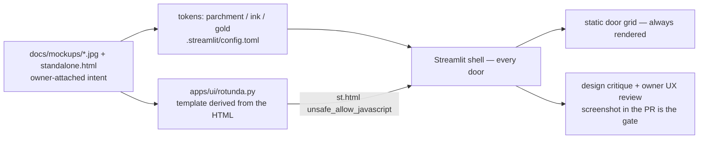

# Design — how the magic-library look reaches the product

The stills in [`docs/mockups/`](../mockups/) are the UX source of truth; this page says how they become shipped UI, which skills gate it, and what is deliberately not built.

## Path from mockup to screen

| Layer | Where | Rule |
|---|---|---|
| Tokens | `.streamlit/config.toml` (`primaryColor #8a5b13`, `backgroundColor #f7f0e3`, serif) | Pinned by `test_streamlit_theme_pins_parchment_gold_from_mockups`; copied into the UI image |
| Rotunda | `apps/ui/rotunda.py` (pure string) + `rotunda_template.html`, rendered inline via `st.html(unsafe_allow_javascript=True)` | Doors injected from `CROSSROADS_DOORS`; Enter is a same-document link (`?door=`) — the iframe route was tried and Streamlit's sandbox blocks parent navigation; reduced motion honoured; the grid beneath is the accessible path |
| Everything else | Streamlit widgets | No custom component framework this week |

## Skills and gates

1. **`design`** (canvas) — used to compare the live door grid against still 05/06 before PR-D; produces the before/after screenshots attached to the PR.
2. **`design:design-critique`** — run on the PR-D screenshots; findings go into the PR, not silently fixed.
3. **Owner UX review** — `/design-login` + `design-sync-ux` are owner-side (`DesignSync push`); agents attach screenshots and wait. Generated UI is not "shipped" until the owner has looked at it.

Design never gates rubric readiness (rows 1–10). The kill criterion is the other way round: PR-A not green ⇒ no rotunda.

## What is not built, and why

| Cut | Reason | Where recorded |
|---|---|---|
| Memory Sphere particles, WebGL, paid rotunda assets | ADR-010 cut order item 2; no budget line for assets | Forgejo issue #24 |
| The HTML fixture's regex "search" and six named wings | `specs/rotunda.md` forbids a second retrieval arm; doors are the product's | PR-D |
| Streamlit Components v2 / iframes | Not in `streamlit==1.62.0`; both iframe routes (`components.v1.html`, `st.iframe`) are sandboxed without `allow-top-navigation`, so the room renders inline with `st.html` | PR-D |
| Cloudflare Pages build | Streamlit is a Python server, not a static site; Community Cloud is the public edition, compose is self-hosted | ADR-006 |
| Server-side TTS / Listen | ADR-009; on-device `speechSynthesis` preview is the planned shape | `specs/audio.md` note |
