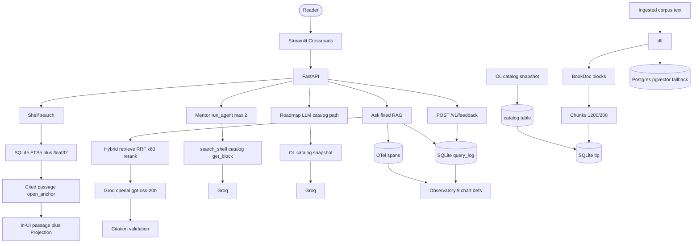
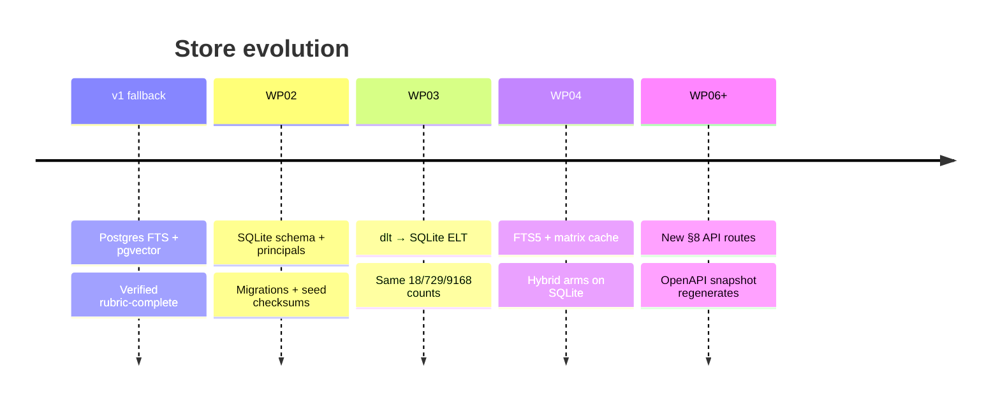
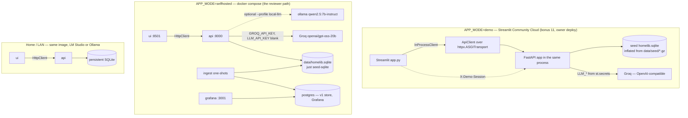
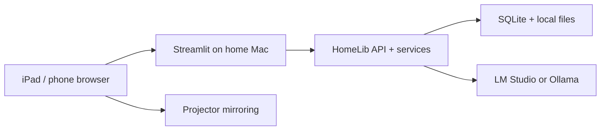

# Architecture overview

HomeLib is a local-first personal knowledge library: ingest books in multiple formats, search with hybrid retrieval, and answer questions with block-level citations. v2 extends v1 from a career-roadmap demo into a universal library product with demo and home editions from one codebase.

See [`specs/product.md`](../../specs/product.md) for the full product narrative.

---

## High-level system diagram

The reader picks a Crossroads door; there is no shared query router. **Ask** is
single-shot hybrid retrieve → rerank → Groq (`openai/gpt-oss-20b`) → citation
validation (or explicit degrade). **Mentor** alone runs `run_agent` (max 2 rounds)
with shelf/catalog/block tools. **Roadmap** is an LLM-assisted catalog path.
Shelf, Coffee Table, and Projection browse/read without calling Groq. The UI
never touches the database — all access goes through `HomelibClient`
([`specs/client.md`](../../specs/client.md)).

Ingest builds readable text into BookDoc blocks and MiniLM embeddings in
**SQLite** (demo tip). Open Library metadata is a **separate catalog snapshot**
loaded into the catalog table — it does not pass through format parsing or
chunking, and it is not full-text reading. Ask writes latency/tokens/cost and
OTel spans; feedback is `POST /v1/feedback` → SQLite. Observatory exposes nine
chart definitions that fill when telemetry exists; the online judge is
**operator-run** (`scripts/judge_recent.py`), off by default. Postgres + pgvector
remains the self-hosted fallback.

---

## v1 vs v2 migration story

| Aspect | v1 (`main`, tag `v1-fallback`) | v2 (`v2` + stacked `feat/wp*`) |
|---|---|---|
| Database | Postgres + `tsvector` + pgvector | SQLite + FTS5 + NumPy matrix ([ADR-004](../adrs/ADR-004-sqlite-replaces-postgres.md)) |
| Monitoring | Grafana (6 panels + feedback) | In-app Observatory ([ADR-005](../adrs/ADR-005-observatory-replaces-grafana.md)) |
| Editions | Single self-hosted compose stack | `APP_MODE=demo` \| `selfhosted` ([ADR-006](../adrs/ADR-006-editions-and-hosting.md)) |
| Identity | Implicit single user | Demo sessions + local principal ([`specs/principals.md`](../../specs/principals.md)) |
| API | 7 live endpoints (OpenAPI pinned) | Product §8 routes — incremental ([`specs/api.md`](../../specs/api.md)) |
| Deploy target | Docker Compose reviewer path | + Streamlit Community Cloud demo (submission day) |

**Migration strategy:** additive, not rip-and-replace. Postgres compose stays on `main` until v2 drill is green. v1 remains eligible as a submission fallback (`v1-fallback` tag). Chunk IDs and ground-truth evals must survive the store switch.

Evidence: [`docs/evidence.md`](../evidence.md) rows for WP02–WP04.

---

## Editions at a glance

From [`specs/editions.md`](../../specs/editions.md) and [ADR-006](../adrs/ADR-006-editions-and-hosting.md):

| Capability | Public showcase (`demo`) | Home / self-hosted (`selfhosted`) | Cloud trial (later) |
|---|---|---|---|
| Interface | Streamlit Community Cloud | Streamlit + FastAPI on LAN/localhost | Hosted web app |
| LLM | App-owner Groq key | Groq in Compose (`GROQ_API_KEY`); Ollama via `--profile local-llm`; LM Studio on the home Mac | Managed + optional BYOK |
| Database | Resettable SQLite seed | Persistent mounted SQLite | Tenant DB |
| Identity | Random `demo_session_id` | Single `local_user` | OIDC |
| Uploads | Disabled | Enabled with rights declaration | Quota storage |
| Mutable state | Session-scoped, TTL | Persistent | Per-account |
| Client | `InProcessClient` | `HttpClient` | TBD |
| Monitoring | Observatory (in-app) | Observatory (Grafana panels are v1 and empty on this path) | TBD |

### Edition topology (who talks to what)

The demo edition has no network hop between UI and API: `InProcessClient` wraps an `ApiClient` over `httpx.ASGITransport`, so route handlers, `LLM_*` wiring and the SQLite store are the same code as compose. The demo principal travels as `X-Demo-Session` (minted once per browser session, `ensure_demo_session`).

**Commercial packaging:** paid Home/Pro features land in the same Forgejo repo after public GitHub publish — not a second remote ([ADR-010](../adrs/ADR-010-commercial-split.md)).

---

## Stack: SQLite + FTS5 + NumPy + optional cloud LLM

### Storage ([ADR-004](../adrs/ADR-004-sqlite-replaces-postgres.md))

- **Lexical arm:** SQLite FTS5 virtual table (`chunks_fts`), BM25 ranking.
- **Vector arm:** Contiguous float32 NumPy matrix in memory, keyed by `index_revision`. Embeddings durable in DB/sidecar; matrix is the query cache — do not decode BLOBs per query.
- **Seed verification:** logical checksums and row counts, not byte-identical `.sqlite` files (SQLite headers/WAL differ across machines).

### Retrieval ([ADR-001](../adrs/ADR-001-retrieval-arm.md))

Production default: **`hybrid_rerank`** (RRF fusion + cross-encoder rerank). Query rewrite is **off** (measured negative result).

Dispatch: set `HOMELIB_SQLITE_PATH` to route `homelib_rag.index` to SQLite; unset uses Postgres (v1).

### LLM ([`specs/provider.md`](../../specs/provider.md))

OpenAI-compatible client. Local-first (Ollama/LM Studio); demo uses managed cloud with cost ceilings. Apple Foundation Models reserved — not capstone week.

### Ingestion

`apps/ingest/pipeline.py` — dlt ELT with staging → canonical sync, idempotent merge keys. v1 destination: Postgres. v2: SQLite ([`specs/ingestion.md`](../../specs/ingestion.md)).

---

## Home topology (self-hosted)

From product §4.3 and mockup `docs/mockups/00-home-topology.png`:

The phone is controller and casting source; the Mac mini runs model and database.

---

## Related pages

- [Decision log](decision-log.md) — why each major choice was made
- [Retrieval pipeline](retrieval-pipeline.md) — arm details and degradation
- [Data model and schemas](data-model-and-schemas.md) — tables and API map
- [Local development](local-development.md) — run it yourself
