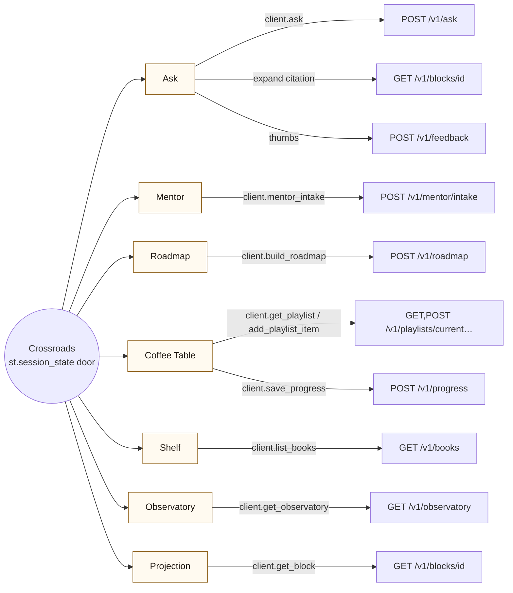
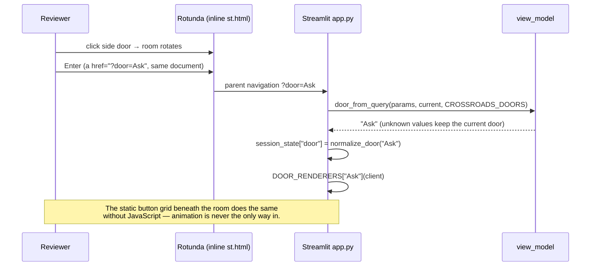

# Crossroads and doors

The Crossroads is the UI's only navigation: one Streamlit page, a door grid (and, since PR-D, the rotunda above it), and one renderer per door. The door set lives in one place — `CROSSROADS_DOORS` in `apps/ui/view_model.py` — and `DOOR_RENDERERS` in `apps/ui/app.py` must cover it exactly (`test_every_door_has_a_renderer_and_vice_versa`). Every door talks to the API through `HomelibClient`; none imports a store.

## Door map

| Door | Renderer | What it proves for the rubric |
|---|---|---|
| Ask | `render_ask_tab` | Retrieval flow + cited answer + feedback (criteria 2, 7) |
| Mentor | `render_mentor_tab` | Agentic intake proposing a path (criterion 12) |
| Roadmap | `render_roadmap_tab` | Catalog tool + ordered steps; unreachable until PR-B wired it |
| Coffee Table | `render_coffee_table_tab` | Persistent per-principal state; demo isolation (`X-Demo-Session`) |
| Shelf | `render_library_tab` | Ingestion readout: books / blocks / chunks / format (criterion 6) |
| Observatory | `render_observatory_tab` | ≥5 charts + feedback on one URL (criterion 7) |
| Projection | `render_projection_tab` | One-page reader with progress save |

## How a door opens

Rules that keep this honest:

- Adding a door = one tuple entry + one dict entry + a line of copy in `apps/ui/rotunda.py`. The parity test fails on any half-done addition.
- `normalize_door` raises on unknown labels; `door_from_query` never does — a stale `?door=` link keeps the current door.
- The rotunda's HTML fixture (`docs/mockups/`) had six named wings and a regex "search". Neither shipped: the doors are the product's, and retrieval belongs to the Ask door (`specs/rotunda.md`).
