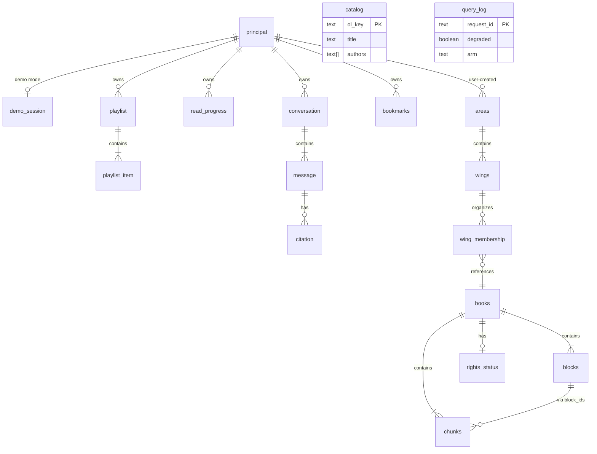
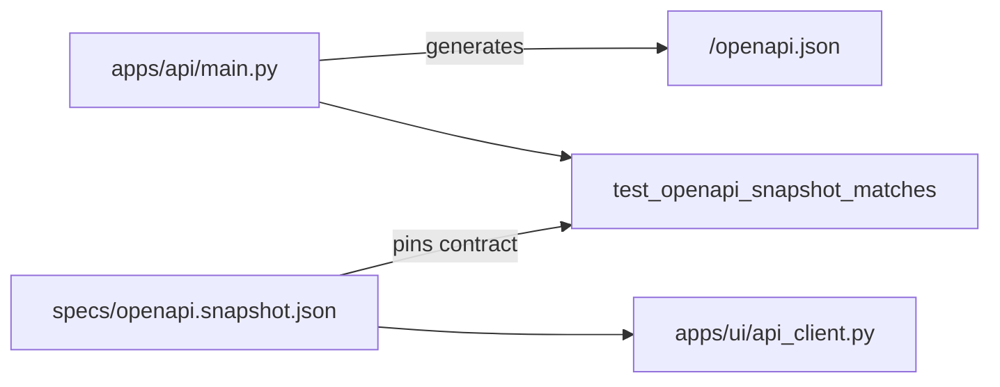

# Data model and schemas

Entity relationships, storage tables, and how they map to the HTTP API. Field-level HTTP shapes live in [`specs/api.md`](../../specs/api.md); this page orients developers and links outward.

**Status:** WP02–WP04 implement corpus + identity + FTS5 on SQLite. Playlist, Mentor, and full §8 routes are schema-ready but mostly **spec-only** until WP06–WP08.

---

## Entity relationship diagram

Seed rows (`books`, `chunks`, seed `areas`/`wings`, `catalog`) have **null `principal_id`** and are read-only shared. Mutable tables require non-null `principal_id`.

Source: [`specs/data-model.md`](../../specs/data-model.md).

---

## Core entities

### Identity

| Table | Purpose | Key fields |
|---|---|---|
| `principal` | Every private write owner | `id`, `kind` (`demo_session` \| `local_user`) |
| `demo_session` | Public showcase isolation | `id`, `principal_id`, `expires_at`, `reset_generation` |

See [`specs/principals.md`](../../specs/principals.md).

### Corpus (ported from v1)

| Table | Purpose | Key fields |
|---|---|---|
| `books` | Indexed shelf | `book_id`, title, authors, `rights_status` |
| `blocks` | Citation / reader unit | `block_id`, `section_path`, char offsets, `page`, `anchor` |
| `chunks` | Retrieval unit | `chunk_id` (**stable vs v1**), `block_ids`, text |
| `chunks_fts` | FTS5 virtual table | indexes chunk text (v2) |
| `chunk_embeddings` | Durable vectors | BLOB or sidecar; query uses matrix cache |

Canonical counts for seed: **18 books / 729 blocks / 9,168 chunks**.

### Library UX

| Table | Purpose | Status |
|---|---|---|
| `areas`, `wings`, `wing_membership` | Crossroads navigation | Schema WP02; UI WP08 |
| `playlist`, `playlist_item` | Coffee Table | Schema WP02; logic WP07 |
| `bookmarks` | Saved passages + notes | Schema WP02 |
| `read_progress`, `listen_progress` | Reading/listening position | Schema WP02; listen reserved (ADR-009) |
| `conversation`, `message`, `citation` | Mentor thread | Schema WP02; routes WP06 |

### Catalog and rights

| Table | Purpose |
|---|---|
| `catalog` | Open Library metadata (3,061 rows) — roadmap / Discover |
| `rights_status` | Per-resource indexing permissions; unknown → fail closed |

See [`specs/rights.md`](../../specs/rights.md), [ADR-008](../adrs/ADR-008-rights-gate.md).

### Observability

| Table | Purpose |
|---|---|
| `query_log` | Request telemetry, `degraded`, feedback, token counts |

---

## v1 Postgres vs v2 SQLite mapping

| v1 (Postgres) | v2 (SQLite) |
|---|---|
| `chunks.tsv` generated column + GIN | `chunks_fts` FTS5 |
| `chunk_embeddings vector(384)` | BLOB + NumPy matrix cache |
| `index_revision` | Same concept — matrix reload trigger |

Dispatch: `HOMELIB_SQLITE_PATH` set → SQLite path in `homelib_rag.index` and `sqlite_index.py`.

---

## API endpoint map

### Live v1 (in OpenAPI snapshot today)

| Method | Path | Purpose |
|---|---|---|
| `GET` | `/health` | DB + LLM reachability, corpus counts |
| `POST` | `/v1/ask` | Grounded cited answer |
| `POST` | `/v1/roadmap` | Reading plan from catalog |
| `POST` | `/v1/ingest` | Ingest path or snapshot |
| `POST` | `/v1/feedback` | Thumbs on `request_id` |
| `GET` | `/v1/books` | Shelf summary |
| `GET` | `/v1/blocks/{block_id}` | Open citation source |

Full request/response fields: [`specs/api.md`](../../specs/api.md) § "live v1".

### v2 target (product §8 — not all in snapshot yet)

| Method | Path | Purpose | WP |
|---|---|---|---|
| `POST` | `/v1/search` | Library-wide hybrid search | WP06 |
| `POST` | `/v1/mentor/intake` | Propose area/wing/path | WP06 |
| `POST` | `/v1/paths` | Persist accepted path | WP06 |
| `GET/POST` | `/v1/areas`, `/v1/wings` | Crossroads CRUD | WP08 |
| `GET` | `/v1/resources` | Shelf + Discover list | WP08 |
| `POST` | `/v1/resources/{id}/search` | Scene search (within book) | WP04/06 |
| `GET/PATCH` | `/v1/playlists/current` | Coffee Table | WP07 |
| `POST` | `/v1/progress` | Read/listen progress | WP07 |
| `GET` | `/v1/observatory` | In-app metrics | WP10 |

`Citation` always carries **both** `chunk_id` and `block_id` — chunk for retrieval, block for reader open ([`specs/api.md`](../../specs/api.md)).

---

## OpenAPI snapshot relationship

- **Snapshot pins v1** until the first v2 API implementation PR regenerates it (WP01 decision).
- Drift test: `evals/tests/test_openapi_snapshot.py`.
- UI and demo scripts depend on snapshot shapes — regenerate and update clients in the same PR when routes change.

v2 additive fields (e.g. `Health.index_revision`, `Health.app_mode`) documented in [`specs/api.md`](../../specs/api.md) § "v2 target" but intentionally absent from snapshot until implemented.

---

## Index and embedding revision

| Field | Role |
|---|---|
| `index_revision` | Bumps when FTS5 or embedding matrix rebuilds; health exposes it |
| Matrix file / cache | Loaded once per revision; avoids per-query BLOB decode |

WP04 evidence: migration v4 introduces `index_revision` + FTS5.

---

## Related pages

- [Decision log](decision-log.md) — storage and rights choices
- [Retrieval pipeline](retrieval-pipeline.md) — how chunks are searched
- [User flows](user-flows.md) — demo session and search sequences
