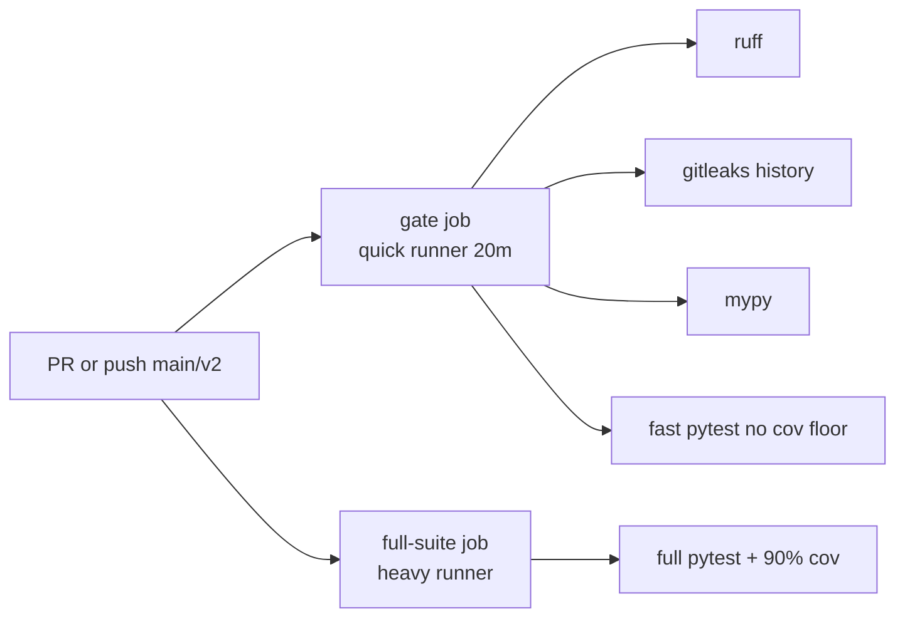

# Debugging and troubleshooting

Common failure modes, CI layout, and hazards recorded in [`docs/evidence.md`](../evidence.md).

---

## Pre-push gate failures

The pre-push hook (`.githooks/pre-push`) runs `just gate-fast`:

| Step | Tool | Typical failure |
|---|---|---|
| Lint | ruff check + format | Unsorted imports, formatting |
| Types | mypy --strict | Missing annotations, untyped defs |
| Secrets | gitleaks git | Credential in history (needs path-scoped allowlist fix) |
| Tests | pytest -q --no-cov -x | First failing test stops run |

**Install hook:** `just hooks` → sets `core.hooksPath .githooks`.

**Do not** use `--no-verify` to bypass — fix in place per studio policy.

If gitleaks is not installed locally, the recipe warns and skips (CI still enforces).

---

## Coverage floor (90%)

Full suite enforces `--cov` with 90% minimum:

```bash
just ci          # includes coverage
just test        # same
```

| Symptom | Likely cause | Fix |
|---|---|---|
| Global 89% | New module with 0% tests | Add behavioural tests (evidence: `build_snapshot.py` lesson) |
| UI untested | Logic in `app.py` | Extract to `view_model.py` (v1 pattern) |
| Branch uncovered | Dead exception path | Named test for the finding |

Scoped coverage for UI: `uv run pytest apps/ui/tests --cov=apps/ui`.

---

## Forgejo CI lanes

From [`.forgejo/workflows/ci.yml`](../../.forgejo/workflows/ci.yml):



**Design notes:**

- `push` scoped to `main` and `v2` only — avoids duplicate runs racing on shared test DB (evidence: runs 12258/12259).
- Quick runner daemon cap 25m — job timeout 20m so overruns report **failed**, not **cancelled**.
- `uv sync --frozen --all-extras` dominates cold job time (~11.5 min) — expected on shared runners.
- Checkout `fetch-depth: 0` required for gitleaks history scan.

**Debug CI locally:** reproduce with `just ci` before push.

---

## dlt / SQLite connection hygiene

WP03 lessons ([`docs/evidence.md`](../evidence.md)):

| Hazard | Mitigation |
|---|---|
| Staging DB left locked | Close connections; use busy timeout; tests use session-scoped fixture |
| Partial sync after catalog error | Transactional canonical sync with rollback |
| Second run duplicates | dlt `merge` + explicit primary keys |
| Transient file-not-found | Pipeline retry (named test) |

**Verify idempotency:**

```bash
uv run pytest apps/ingest/tests/test_sqlite_ingest.py -v -k idempotent
```

**v1 Postgres integration tests** skip if DB unreachable — **0 skipped** is the meaningful green (not "37 passed, 1 skipped").

---

## Eval regression gate

```bash
just eval-retrieval
uv run python evals/gate.py
```

| Rule | Meaning |
|---|---|
| Baseline in `evals/eval-baseline.json` | Floors from measured ADR-001 values |
| Missing metric in run | Counts as **regression** |
| Baseline without note | Gate refuses to load |

Retrieval eval is deterministic (two identical runs) — margins stay tight (0.01).

LLM eval is **non-deterministic** — do not treat single-run scores as stable ([`docs/evidence.md`](../evidence.md) determinism retracted).

---

## Known hazards from evidence

### Infrastructure

| Hazard | Detail | Mitigation |
|---|---|---|
| Compose project name | Default `docker/` collides; empty volume on restart | Always `-p homelib` |
| Missing `--env-file` | Blank Postgres password, silent warning | `just` recipes enforce `.env` |
| Docker credential helper hang | `credsStore: desktop` stale auths | `docker logout` or clean `DOCKER_CONFIG` |
| Port conflicts | 8000/8501/11434 taken | Override in `.env` |
| Shared test DB name | Parallel CI runs DROP/CREATE race | Per-process DB name (fixed) |

### Retrieval / LLM

| Hazard | Detail | Mitigation |
|---|---|---|
| Ollama silent truncation | Over-long prompt answered without error | Pin `OLLAMA_CONTEXT_LENGTH=16384` |
| num_ctx on host | Undeclared local `launchctl` env | Document in compose |
| Model `{}` JSON failures | 7B contract failures, not truncation | ADR-003 null prompt swap |
| chunk_id vs block_id | `/v1/blocks/{chunk_id}` → 404 | Citations carry both ids |
| Rewrite noise | No measured gain | Default off ADR-001 |

### Data / ingest

| Hazard | Detail | Mitigation |
|---|---|---|
| CRLF chapter detection | Single block for all books | Newline normalization in snapshot |
| gzip byte instability | Filename in gzip header | `filename=""` on write |
| SQLite seed bytes | Not reproducible cross-machine | Logical checksums ADR-004 |
| Kaggle corpus | License trap | grep test + ADR-002 |

### v2-specific

| Hazard | Detail | Status |
|---|---|---|
| Two stores (PG + SQLite) | Confusion about which is live | `HOMELIB_SQLITE_PATH` dispatch |
| Early Cloud canary | VOID per addendum | Local demo rehearsal only |
| Calendar weekday drift | plan-v2.md frozen | evidence addendum §1 |

---

## UI/API boundary debugging

AST test enforces no direct DB imports in UI:

```bash
uv run pytest apps/ui/tests -v -k boundary
```

If citation "open source" fails end-to-end, run `just drill` on a **quiet machine** — saturated host gave inconclusive results (evidence).

---

## Getting help from logs

```bash
just logs api
just logs ui

# Query log (v1 postgres)
docker compose -p homelib --env-file .env -f docker/docker-compose.yml \
  exec postgres psql -U homelib \
  -c "SELECT request_id, arm, degraded, feedback FROM query_log ORDER BY ts DESC LIMIT 5;"
```

---

## Related pages

- [Local development](local-development.md)
- [Retrieval pipeline](retrieval-pipeline.md)
- [Improving the system](improving-the-system.md)
