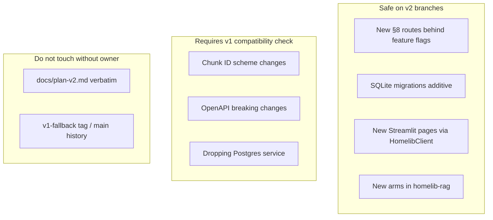

# Improving the system

Extension points, test discipline, and how to add features without breaking the v1 fallback.

---

## Extension points

### New corpus connectors

Lawful catalog sources only ([ADR-008](../adrs/ADR-008-rights-gate.md), [`specs/connectors.md`](../../specs/connectors.md)):

1. Add connector module with `rights_status` on every hit.
2. Unknown rights → metadata-only; never index full text.
3. Extend grep ban test for new prohibited source names.
4. Wire into Discover / Forbidden Stacks UI (WP05+).

**Banned permanently for corpus / snapshot ingest:** Kaggle book scrapes, Google Books as redistributed catalog dump, Goodreads graph, Anna's Archive, Sci-Hub, LibGen, course FAQ corpus. **Allowed as live Discover metadata only:** official Google Books volumes API (API key) and Hardcover GraphQL search (Bearer token) — links out, never Ask RAG ingest.

### New document formats

1. Spec in `specs/formats.md` (or extend it).
2. Handler in `packages/homelib-core/src/homelib_core/formats/`.
3. Register in dispatcher; return `ExtractionResult`.
4. Behavioural tests including edge cases (zip bomb, OCR, encoding).
5. Re-run `build_snapshot` if seed corpus affected.

### New retrieval arms or fusion

1. Update [`specs/indexing.md`](../../specs/indexing.md) or [`specs/hybrid.md`](../../specs/hybrid.md).
2. Implement in `homelib-rag`; preserve `Hit` shape.
3. Add arm to `evals/retrieval_eval.py`.
4. Run full bake-off; write ADR if changing production default.
5. Update `evals/eval-baseline.json` with measured floors + honest note.

### New API routes (v2 §8)

1. Field-level spec in [`specs/api.md`](../../specs/api.md).
2. Request models: `extra="forbid"`.
3. Regenerate [`specs/openapi.snapshot.json`](../../specs/openapi.snapshot.json) in same PR.
4. Extend `HomelibClient` + conformance tests ([`specs/client.md`](../../specs/client.md)).
5. Principal checks on mutating routes ([`specs/principals.md`](../../specs/principals.md)).

### Editions and entitlements

[`specs/editions.md`](../../specs/editions.md) + [`EntitlementProvider`](../../specs/editions.md):

- Gate uploads, audio generation, persistence mode.
- Paid Home/Pro tables **after** `just publish` ([ADR-010](../adrs/ADR-010-commercial-split.md)).

### Post-publish commercial tier

ADR-010 evening pivot: single Forgejo repo until public GitHub snapshot; then private Forgejo copy for paid features. Do not commit premium assets, signing keys, or proprietary rotunda/sphere assets before publish.

---

## Test discipline

### Spec-first workflow

1. Read or write the one-page spec in `specs/`.
2. Add **named red tests** from the spec before implementation.
3. Implement minimal code to green tests.
4. Record verify commands in [`docs/evidence.md`](../evidence.md).

### One-test-per-finding

Every HIGH/MED audit finding, review blocker, or bug fix ships with at least one **behavioural** named test in the same PR — not string-match assertions.

Examples from evidence:

- `test_epub_zip_bomb_guard` — security cap
- `test_rrf_hand_computed` — fusion arithmetic
- `test_citation_block_id_resolves` — drill-found UI bug
- `test_chunk_ids_match_v1_snapshot` — eval continuity

### Degradation tests

If a spec promises fail-open behaviour, test the failure path explicitly:

- `test_rerank_failure_preserves_order`
- `test_vector_down_degrades_flagged`
- `test_search_with_llm_unreachable`

### Eval before default changes

Do not change production retrieval arm or answer prompt without:

```bash
just eval-retrieval   # or eval-llm for prompts
uv run python evals/gate.py
```

Update ADR with numbers — including **negative results** (rewrite, prompt bake-off).

---

## Where to add features safely



### v1 fallback rules

| Change | Safe? |
|---|---|
| Add SQLite path alongside Postgres | Yes (WP02–04 pattern) |
| Change chunk_id algorithm | **No** — breaks ground truth |
| Remove `/v1/roadmap` before alias | **No** — dual-write or alias first |
| Drop Grafana from compose | Only after Observatory green |
| Merge `v2` → `main` | Only after v2 drill green |

Tag `v1-fallback` at `535f58b` remains the NO-GO submission path ([`CHECKLIST.md`](../../CHECKLIST.md) §F).

### Import boundaries

| Layer | May import |
|---|---|
| `apps/ui` | `HomelibClient`, shared Pydantic types |
| `apps/api` | store, rag, core, provider |
| `packages/homelib-rag` | core models; not Streamlit |
| `apps/ingest` | core, dlt; not UI |

Enforced by AST test in `apps/ui/tests`.

---

## Performance improvement ideas (recorded headroom)

From ADR-001 proximity probe — retrieval finds correct book ~65% of time; chunk-exact metric understates usefulness but absolute headroom remains:

- Chunking granularity experiments (re-run pipeline only).
- Ground-truth question quality filter (~⅓ low-signal "what does author describe" shape).
- ONNX embedder if Cloud RSS fails ([Decision log](decision-log.md)).
- Incremental single-book re-ingest (nice-to-have, [`CHECKLIST.md`](../../CHECKLIST.md) §D).

---

## Documentation improvements

When you change behaviour:

1. Update the relevant `specs/*.md` section.
2. Add ADR if architectural fork.
3. Append row to [`docs/evidence.md`](../evidence.md) with verify commands.
4. Update this wiki page or link to ADR — avoid duplicating product.md verbatim.

Wiki sync: commit under `docs/wiki/`; push to Forgejo; import or sync to Forgejo wiki UI.

---

## Related pages

- [Decision log](decision-log.md)
- [Repo structure](repo-structure.md)
- [Debugging and troubleshooting](debugging-and-troubleshooting.md)
- [Architecture overview](architecture-overview.md)
