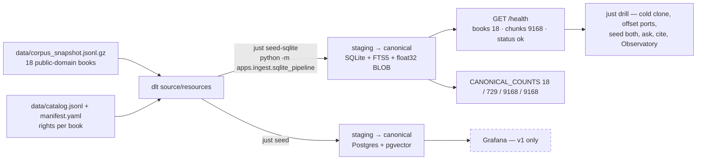

# Local development

How to install, run gates, and rehearse demo vs self-hosted editions locally.

---

## Prerequisites

| Tool | Version / notes |
|---|---|
| Python | 3.13 (CI pins `UV_PYTHON=3.13`) |
| [uv](https://docs.astral.sh/uv/) | Dependency management; `uv.lock` authoritative |
| Docker Desktop | v1 compose stack (Postgres, Ollama, Grafana) |
| just | `brew install just` — canonical entry points |
| gitleaks | Optional locally; enforced in CI (`brew install gitleaks`) |
| Ollama (optional) | Host-side GPU override via `host.docker.internal` |
| djvulibre | Optional; DjVu tests skip cleanly if `djvutxt` missing |

**Optional for full format coverage:** Tesseract (scanned PDF OCR tests).

---

## First-time setup

```bash
cd /path/to/homelib
cp .env.example .env
uv sync --all-extras
just hooks          # optional: install pre-push gate
```

Edit `.env` for port overrides if defaults are taken (`API_PORT`, `UI_PORT`, etc.).

---

## Canonical commands

| Command | What it runs |
|---|---|
| `just` | List all recipes |
| `just ci` | ruff + mypy + gitleaks + pytest with **90% coverage floor** |
| `just gate-fast` | Pre-push hook subset (~under 1 min) |
| `just test-fast` | pytest -x, no coverage |
| `just fmt` | ruff format + fix |
| `just up` | `docker compose -p homelib --env-file .env -f docker/docker-compose.yml up -d --build` |
| `just seed` | One-shot ingest via compose profile |
| `just seed-sqlite` | One-shot SQLite seed (`apps/ingest/sqlite_pipeline`) — the store the API reads |
| `just down` | Stop stack |
| `just eval-retrieval` | Retrieval bake-off |
| `just eval-llm` | LLM prompt bake-off (bounded) |
| `just drill` | Cold-clone reproducibility gate |

**Rule:** every compose invocation needs `--env-file .env` and `-p homelib` ([`justfile`](../../justfile) bakes both in).

---

## Reviewer path (compose): two seeds, one health check


Until `just seed-sqlite` has run, `/health` is HTTP 200 with `"status": "degraded"` and `"books": 0` — SQLite creates the file on first connect, and PR-A made that emptiness loud instead of silent.

## v1 stack (Postgres — `main` / reviewer path)

```bash
just up
just seed
just seed-sqlite   # the store the API reads (ADR-004); /health goes ok 18/9168
open http://localhost:8501    # UI
open http://localhost:8000/docs
```

Default ports (override in `.env`):

| Service | URL |
|---|---|
| UI (MagicLib) | http://localhost:8501 — on your LAN host set `HOMELIB_UI_BIND=0.0.0.0` and open **http://\<lan-host\>:8501** |
| Clean read HTML | http://localhost:8502/read/{book_id} — Safari Listen to Page |
| API | http://localhost:8000/docs (stay loopback; UI reaches it on Docker network) |
| Grafana | http://localhost:3001 |

### iPad / AirPlay / Speak Screen

1. LAN host `.env`: `HOMELIB_UI_BIND=0.0.0.0`, recreate UI (`just up`).
2. iPad Safari → `http://<lan-host>:8501` → MagicLib.
3. **Projection** defaults to **This shelf** for seeded books; **Official preview** shows publisher links only by default. `HOMELIB_OFFICIAL_VIEWER=1` opts in to the chrome-free two-page viewer for those publisher previews (off by default, never used by the public demo).
4. **Enter projector mode**, then Screen Mirroring to the projector.
5. Speak Screen on the chrome-free stage; Listen to Page on `:8502/read/...` (shelf) or Pottermore `bookN/` (official).

Quickstart also in [`README.md`](../../README.md).

---

## v2 rehearsal (SQLite — feature branches)

v2 store is **additive**; Postgres compose remains until v2 merges to `main`.

### Environment

```bash
# .env
APP_MODE=demo              # or selfhosted
HOMELIB_SQLITE_PATH=data/homelib.sqlite
```

| Variable | Purpose |
|---|---|
| `APP_MODE` | `demo` = resettable showcase; `selfhosted` = persistent home |
| `HOMELIB_SQLITE_PATH` | Enables SQLite retrieval dispatch in `homelib_rag` |
| `LLM_MAX_OUTPUT_TOKENS` | Default 800; paths may request up to 1600 |
| `LLM_TIMEOUT_SECONDS` | 300 for Compose; 90 suggested for cloud demo only |
| `EMBED_MODEL` | `sentence-transformers/all-MiniLM-L6-v2` |

See [`specs/editions.md`](../../specs/editions.md), [`.env.example`](../../.env.example).

### SQLite ingest + tests

```bash
# After WP03+ on branch
uv run pytest apps/store/tests/test_sqlite.py -v
uv run pytest apps/ingest/tests/test_sqlite_ingest.py -v
uv run pytest packages/homelib-rag/tests/test_sqlite_index.py \
             packages/homelib-rag/tests/test_hybrid.py \
             packages/homelib-rag/tests/test_scene_search.py -v
```

Run pipeline against SQLite (see ingest module for staging path).

### Demo smoke (Sep 2 gate per evidence addendum)

Local `APP_MODE=demo` + SQLite tests green — **not** a live Streamlit Cloud canary until submission day ([`docs/evidence.md`](../evidence.md) addendum §2).

---

## APP_MODE behaviour

| Mode | Client (target) | DB | Uploads | Banner |
|---|---|---|---|---|
| `demo` | InProcessClient | Resettable seed SQLite | Disabled (403) | Public showcase |
| `selfhosted` | HttpClient | Persistent SQLite file | Enabled (with rights) | None |

Unknown `APP_MODE` → process refuses to start.

---

## Compose profiles

Current [`docker/docker-compose.yml`](../../docker/docker-compose.yml) services:

| Service | Profile | Notes |
|---|---|---|
| postgres | default | v1 store |
| ollama | default | Local LLM; context pinned `OLLAMA_CONTEXT_LENGTH=16384` |
| api, ui | default | FastAPI + Streamlit |
| grafana | default | v1 monitoring — Observatory replaces in v2 |
| ingest | `seed` | One-shot dlt load (`just seed`) |

v2 does **not** drop Postgres from compose until explicitly scheduled — ADR-004.

---

## Common debug commands

```bash
# Fast iteration
just test-fast
uv run pytest path/to/test_file.py -v -k 'pattern'

# Lint single package
uv run ruff check packages/homelib-rag
uv run mypy packages/homelib-rag

# Compose health
just ps
just logs api

# DB counts (v1)
docker compose -p homelib --env-file .env -f docker/docker-compose.yml \
  exec postgres psql -U homelib -c "SELECT count(*) FROM chunks;"

# Retrieval smoke
just demo-ask "What is compound interest?"

# Eval
just eval-retrieval
uv run python evals/gate.py

# Find listening ports
docker compose -p homelib --env-file .env -f docker/docker-compose.yml port api 8000
```

---

## LM Studio (Mac home edition)

Preferred home path ([ADR-006](../adrs/ADR-006-editions-and-hosting.md)):

```bash
# .env for selfhosted
APP_MODE=selfhosted
LLM_BASE_URL=http://host.docker.internal:1234/v1
LLM_API_KEY=lm-studio
LLM_MODEL=<your loaded model>
```

Compose reviewer default stays Ollama in-container.

---

## Related pages

- [Debugging and troubleshooting](debugging-and-troubleshooting.md)
- [Repo structure](repo-structure.md)
- [Architecture overview](architecture-overview.md)
