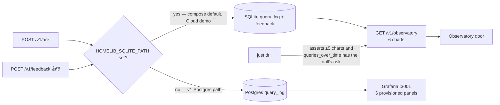

# Monitoring and feedback

Two monitoring surfaces exist in the repo. Only one sees the tip path's traffic. This page says which, and what the drill asserts.

| Surface | Reads | Populated when | Asserted by |
|---|---|---|---|
| Observatory door (`GET /v1/observatory`) | SQLite `query_log`, feedback | Always on the tip path (compose sets `HOMELIB_SQLITE_PATH`) | `scripts/cold_clone_drill.sh` monitoring step; `apps/store/tests` |
| Grafana dashboard | Postgres `query_log` | Only with `HOMELIB_SQLITE_PATH` unset (tag `v1-fallback`) | nothing on the tip path — its panels are empty there |

The six Observatory charts: `queries_over_time`, `latency_p50_p95`, `retrieval_mode_usage`, `feedback_ratio`, `degraded_or_no_result`, `token_or_cost_estimate` (`apps/store/observatory.py`). `scripts/demo_traffic.py --n 40` fills them on a fresh seed.

Until 2026-09-05 the drill "verified monitoring" by counting Grafana's provisioned panels — a check that passes with zero traffic. It now requires the ask it just made to appear in `queries_over_time` ([ADR-005 addendum](../adrs/ADR-005-observatory-replaces-grafana.md)). Removing the `grafana` service from compose is an owner decision, not done.
