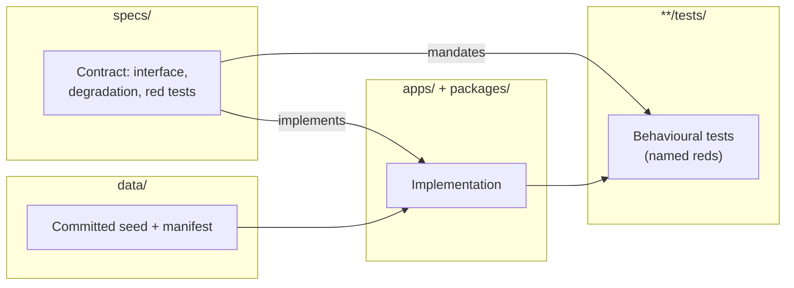
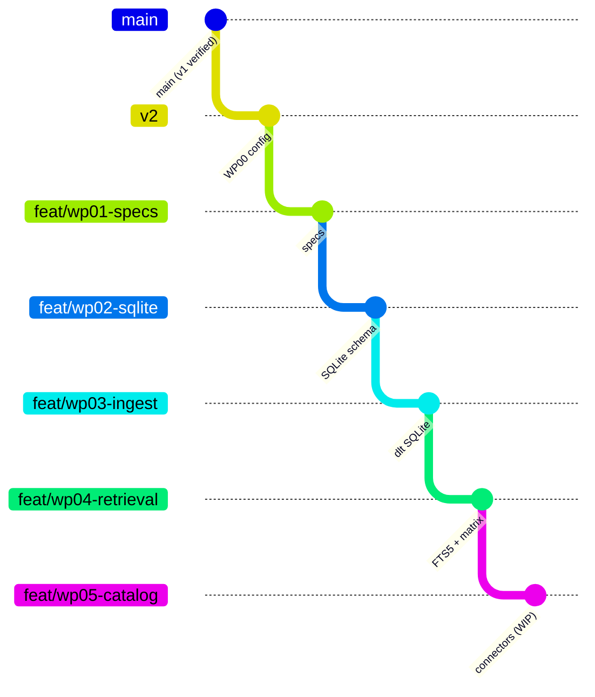

# Repo structure

Where everything lives in the HomeLib monorepo and how branches are organized.

---

## Top-level directory tree

```text
homelib/
├── apps/                 # Runnable applications
│   ├── api/              # FastAPI HTTP service (v1 live; v2 §8 routes incremental)
│   ├── ingest/           # dlt pipeline, corpus fetch, snapshot build
│   ├── store/            # SQLite schema, migrations, principals (v2 WP02+)
│   └── ui/               # Streamlit front-end (API-only boundary)
├── packages/
│   ├── homelib-core/     # Parse, normalize, chunk, shared models
│   └── homelib-rag/      # Index, hybrid, rerank, rewrite, answer, agent
├── specs/                # One-page specs (written before code)
├── docs/
│   ├── adrs/             # Architecture decision records
│   ├── wiki/             # This developer wiki (Forgejo-syncable)
│   ├── evidence.md       # Build verification log
│   ├── plan-v2.md        # Execution plan (verbatim freeze — do not edit)
│   └── mockups/          # UX reference stills + HTML prototype
├── data/
│   ├── manifest.yaml     # Pinned corpus URLs + sha256
│   ├── catalog.jsonl     # Open Library metadata
│   ├── corpus_snapshot.jsonl.gz
│   └── books/            # git-ignored personal uploads
├── docker/               # Compose, Dockerfiles, initdb, Grafana provisioning
├── evals/                # Retrieval + LLM eval harness, baselines, gate
├── scripts/              # Demo helpers, cold-clone drill
├── tests/                # Repo-wide tests (e.g. OpenAPI drift)
├── .forgejo/workflows/   # CI (gate + full-suite lanes)
├── justfile              # Canonical local commands
├── CHECKLIST.md          # Rubric + v2 progress
└── README.md             # Reviewer-facing quickstart (v1 compose path)
```

---

## Apps

| Path | Purpose | Key entry points |
|---|---|---|
| `apps/api/` | HTTP API, OpenAPI | `main.py`, `schemas.py` |
| `apps/ingest/` | ELT pipeline | `pipeline.py`, `fetch_corpus.py`, `build_snapshot.py` |
| `apps/store/` | SQLite store (v2) | migrations, `UserRepository`, demo reset |
| `apps/ui/` | Streamlit UI | `app.py`, `api_client.py`, `view_model.py` |
| `apps/runtime_settings.py` | `APP_MODE`, env loading | shared config |

---

## Packages

| Package | Responsibility |
|---|---|
| `homelib-core` | `parse_file()` per format (EPUB, PDF, DjVu, TXT), `chunk_book()`, Pydantic models |
| `homelib-rag` | `search_lexical` / `search_vector`, `hybrid_search`, `rerank`, `rewrite_query`, grounded answer, agent tools |

Import rule: UI must not import store, dlt, or RAG internals — only `HomelibClient` ([`specs/client.md`](../../specs/client.md)).

---

## Specs vs code vs tests vs data



| Layer | Location | Convention |
|---|---|---|
| **Specs** | `specs/*.md` | Sections: Purpose, Public interface, Data contracts, Error/degradation, Named red tests, Verify |
| **Code** | `apps/`, `packages/*/src/` | Matches spec module path in heading |
| **Unit tests** | Colocated `tests/` under each app/package | Named tests from spec |
| **Integration tests** | `apps/ingest/tests/`, eval scripts | Live DB or `HOMELIB_SQLITE_PATH` |
| **Contract tests** | `evals/tests/`, `tests/` | OpenAPI snapshot, eval gate |
| **Seed data** | `data/` | Public domain only; personal books git-ignored |

---

## Docker and CI

| Path | Role |
|---|---|
| `docker/docker-compose.yml` | v1 stack: postgres, ollama, api, ui, grafana, ingest profile |
| `docker/initdb/` | Postgres schema DDL |
| `docker/*.Dockerfile` | Service images |
| `.forgejo/workflows/ci.yml` | `gate` (quick) + `full-suite` (heavy, coverage floor) |
| `.githooks/pre-push` | Fast local gate |
| `.gitleaks.toml` | Secret scan config |

---

## Branch model



| Branch | Role |
|---|---|
| `main` | v1 verified baseline; never rewrite history |
| `v1-fallback` | Annotated tag on last known-good v1 (`535f58b`) |
| `v2` | Integration branch for capstone v2 |
| `feat/wp*` | Stacked work packages; oldest-first review ~10 PRs into `v2` |
| `feat/scaffold` | Original v1 development branch (historical) |

**Stacking protocol** ([`CHECKLIST.md`](../../CHECKLIST.md) §I): rebase-merge into `v2`; restack downstream PRs after merge; newer PRs stay draft until dependencies land. `v2` → `main` blocked until v2 drill green.

Current feature work (Sep 2026): `feat/wp05-catalog` stacked on WP04 retrieval.

---

## Documentation map

| Audience | Start here |
|---|---|
| Reviewer / course grader | `README.md`, `docs/course-map.md` |
| Product intent | `specs/product.md` |
| Developer onboarding | `docs/wiki/README.md` (this wiki) |
| Build status | `docs/evidence.md`, `CHECKLIST.md` |
| API contract (live) | `specs/openapi.snapshot.json`, `/docs` on running API |

---

## Related pages

- [Architecture overview](architecture-overview.md)
- [Local development](local-development.md)
- [Improving the system](improving-the-system.md)
