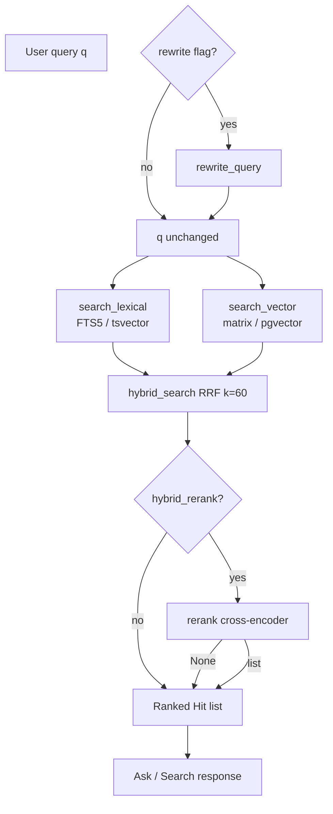

# Retrieval pipeline

How HomeLib finds relevant passages: two search arms, fusion, optional rerank and rewrite, scene modes, and the `degraded` contract.

Canonical measurement: [ADR-001](../adrs/ADR-001-retrieval-arm.md). Module specs: [`specs/indexing.md`](../../specs/indexing.md), [`specs/hybrid.md`](../../specs/hybrid.md), [`specs/rerank.md`](../../specs/rerank.md), [`specs/rewrite.md`](../../specs/rewrite.md), [`specs/scene-search.md`](../../specs/scene-search.md).

---

## Pipeline overview



**Production default:** `hybrid_rerank` with rewrite **off**.

---

## Arm 1: Lexical (FTS5 / BM25)

| Aspect | v1 Postgres | v2 SQLite |
|---|---|---|
| Index | Generated `tsvector` + GIN | FTS5 `chunks_fts` |
| Query | `plainto_tsquery('english', q)` | FTS5 MATCH |
| Score | `ts_rank_cd` | BM25 via FTS5 |
| Latency | ~77 ms (measured) | Comparable target |

**Strengths:** exact phrases, proper nouns, numbers. **Weaknesses:** paraphrase.

Empty query → `ValueError` (never fake empty results).

---

## Arm 2: Vector (semantic)

| Aspect | Detail |
|---|---|
| Model | `sentence-transformers/all-MiniLM-L6-v2` (384-dim) |
| Corpus vectors | Computed at ingest; stored in DB |
| Query embed | In-process torch (or matrix dot product against cached matrix) |
| Score | Cosine similarity (1 − distance) |
| Latency | ~137 ms vector-only (v1 measured) |

**v2 cache:** NumPy float32 matrix keyed by `index_revision` — load once, avoid per-query BLOB decode ([ADR-004](../adrs/ADR-004-sqlite-replaces-postgres.md)).

**Strengths:** paraphrase, conceptual match. **Weaknesses:** rare tokens, numbers.

---

## RRF fusion (hybrid)

Reciprocal Rank Fusion ([`specs/hybrid.md`](../../specs/hybrid.md)):

```
rrf_score(chunk) = Σ 1/(K + rank_arm(chunk))   where K = 60
```

- Dedup by `chunk_id`; scores sum when chunk appears in both arms.
- Returns `(hits, mode_used)` — `mode_used` reflects **actual** arm after degradation.

### Degradation matrix

| Condition | Behaviour | `mode_used` |
|---|---|---|
| Both arms OK | Full fusion | `hybrid` |
| Vector down | Lexical only | `lexical` |
| Lexical down | Vector only | `vector` |
| Both down | Exception propagates | — |
| `mode=lexical` only | No fallback | raises if down |

Named red: `test_rrf_hand_computed`, `test_vector_down_degrades_flagged`.

---

## Rerank (fail-open)

Cross-encoder: `cross-encoder/ms-marco-MiniLM-L-6-v2`.

| Return | Meaning | Caller action |
|---|---|---|
| `list[Hit]` | Reordered; scores replaced | Use reranked list |
| `None` | Load or score failure | Keep fusion order |
| `[]` | Empty input | Nothing to rerank |

**Never fail the request** because rerank failed ([`specs/rerank.md`](../../specs/rerank.md)).

Evidence: rerank lifts MRR 0.152 → 0.167; hit-rate unchanged (reorders only) — ADR-001.

---

## Rewrite (fail-open, default off)

Optional LLM step before search ([`specs/rewrite.md`](../../specs/rewrite.md)):

- Success → stripped `rewritten_query`
- Any failure → original `q` unchanged (no raise, no empty string)

**Measured result (ADR-001):** on 80-question matched sample, rewrite off ≥ rewrite on hit-rate; MRR slightly worse with rewrite on. Default stays **false**.

Rewrite duplicates work the lexical arm already approximates via tokenization.

---

## Scene search modes

Within-resource search ([`specs/scene-search.md`](../../specs/scene-search.md)):

| Mode | LLM required | Behaviour |
|---|---|---|
| `exact` | No | Normalized phrase match; original char offsets |
| `keyword` | No | FTS5/BM25 in scope |
| `semantic` | No | Vector in scope |
| `smart` | No | Hybrid + optional rerank in scope |
| `ask` | Yes | Smart hits + cited synthesis |

**Scope:** path `{resource_id}` only; optional `chapter_id` filter. Rewrite must re-apply scope after expansion (`test_book_scope_survives_rewrite`).

**Rights:** `can_index_text=false` → **409** with explanation, not empty hits pretending success.

**Offline LLM:** Exact/Keyword/Semantic/Smart still return hits; Ask returns Smart hits + `degraded: true` without synthesis.

---

## `Hit` shape (shared contract)

```python
class Hit:
    chunk_id: str
    book_id: str
    score: float      # arm-specific until fusion re-scores
    rank: int         # 1-based dense
    text: str
    section_path: list[str]
    page: int | None
```

Defined once in [`specs/indexing.md`](../../specs/indexing.md). Hybrid replaces `score`/`rank`; rerank replaces again.

---

## `degraded` flags contract

`degraded: bool` on API responses and `query_log.degraded` means **a fallback path ran** — not necessarily total failure.

| Situation | HTTP | `degraded` | User-visible |
|---|---|---|---|
| Vector down, lexical OK | 200 | true | Answer/hits from lexical |
| Rerank down | 200 | false* | Fusion order (*unless other fallback) |
| LLM down on ask | 200 | true | Retrieval-only or apology text |
| Citation validation fail | 200 | true | Safe message |
| Both arms down | 5xx | — | Error |

*Rerank failure alone does not set degraded if fusion result is still valid production path — check `arm_used` in logs.

Scene search: `test_search_with_llm_unreachable` — Smart works, Ask degrades.

Monitoring: Observatory panels include degraded-answer rate ([`specs/observatory.md`](../../specs/observatory.md)).

---

## Store dispatch

```python
# homelib_rag.index — simplified
if os.environ.get("HOMELIB_SQLITE_PATH"):
    return sqlite_index.search_lexical / search_vector
else:
    return postgres_index.search_lexical / search_vector
```

Set `HOMELIB_SQLITE_PATH` for v2 SQLite tests and local v2 rehearsal.

---

## Evaluation

```bash
just eval-retrieval    # 4 arms × 235 questions, ~155s, no LLM
```

Baselines: [`evals/eval-baseline.json`](../../evals/eval-baseline.json). Missing metric in a run = regression.

Rewrite comparison:

```bash
uv run python evals/retrieval_eval.py --questions 80 --arm hybrid_rerank
uv run python evals/retrieval_eval.py --questions 80 --arm hybrid_rerank --rewrite
```

---

## Related pages

- [Decision log](decision-log.md) — why hybrid_rerank and rewrite off
- [User flows](user-flows.md) — search → answer sequence
- [Debugging and troubleshooting](debugging-and-troubleshooting.md) — eval regression gate
