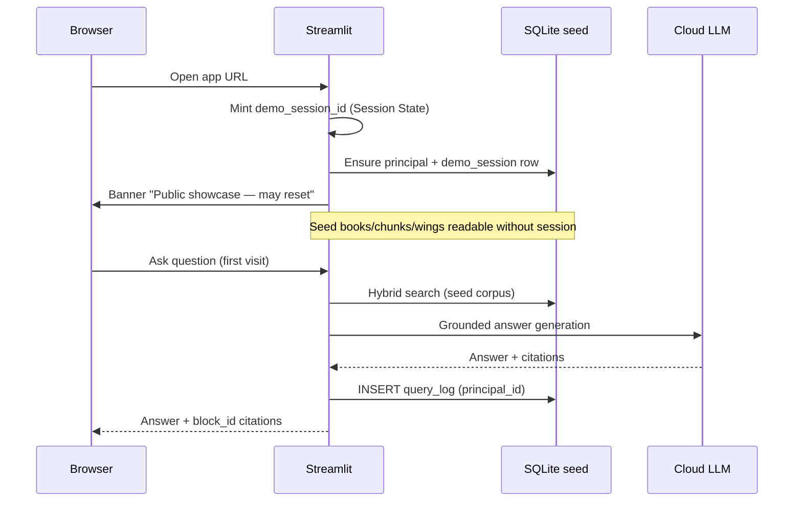
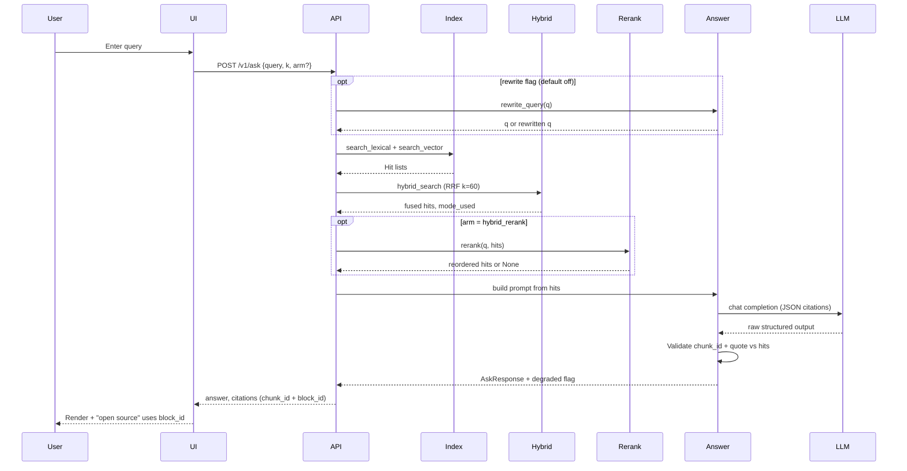
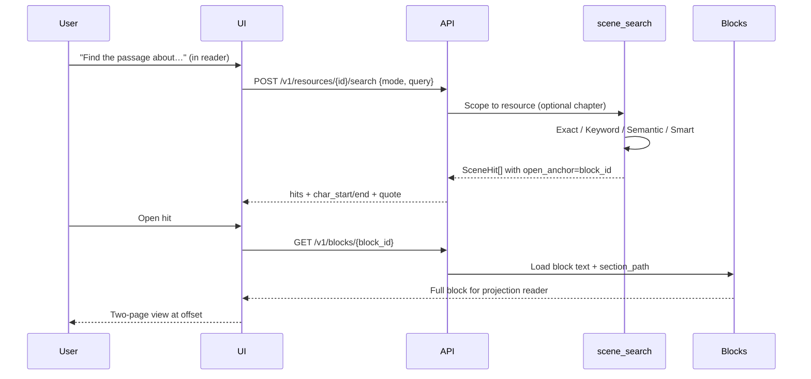
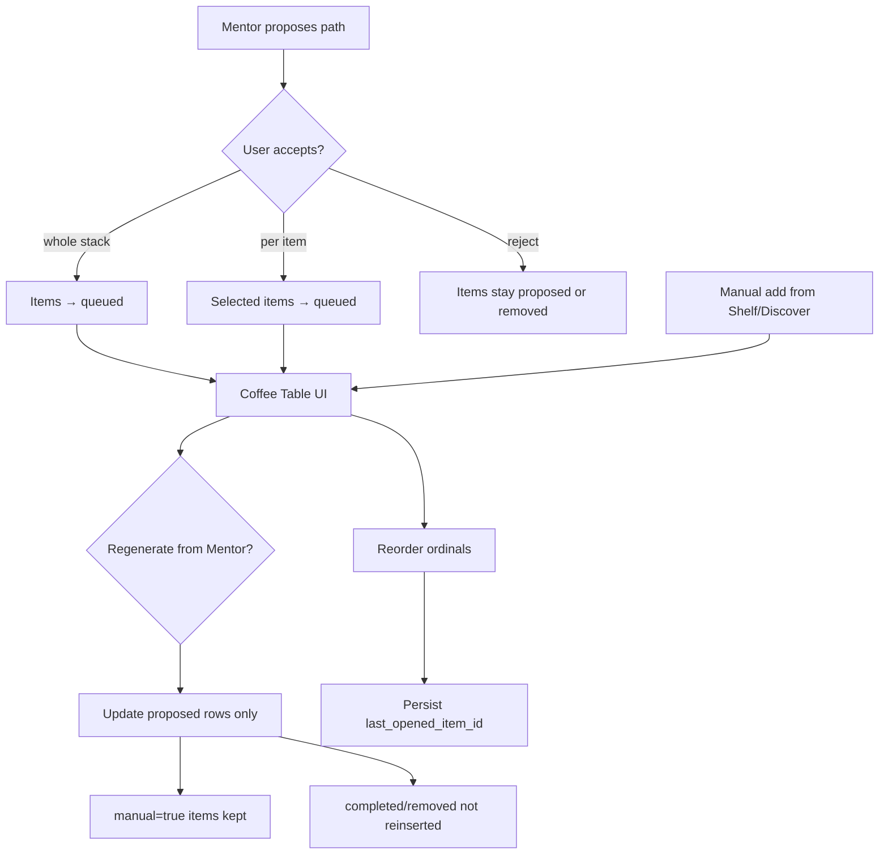
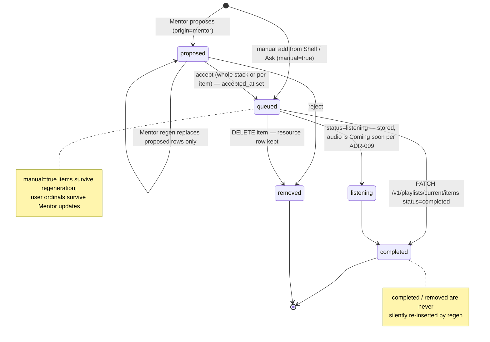
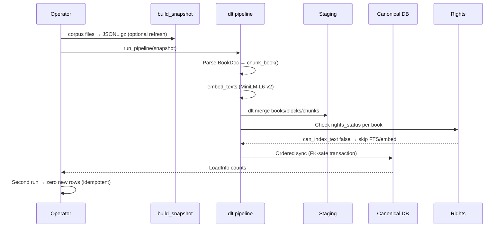
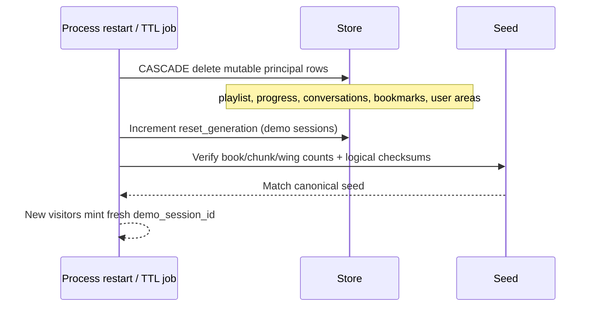

# User flows

Sequence and flow diagrams for primary user journeys. **Implemented** flows note their evidence; **spec-level** flows describe product intent before full UI/API merge (WP06–WP08).

References: [`specs/product.md`](../../specs/product.md) §§2, 5; [`specs/principals.md`](../../specs/principals.md).

---

## Cold start / demo session

Public showcase: every browser gets an isolated session; seed corpus is shared read-only.



**Implemented:** v1 ask path on Postgres; v2 demo rehearsal = `APP_MODE=demo` + SQLite tests (WP02–WP04). Full `InProcessClient` — spec/WP08.

**Rules:** mutable rows FK `principal_id`; null-owner writes refused; uploads disabled in demo ([`specs/editions.md`](../../specs/editions.md)).

---

## Search → cited answer

Library-wide question with hybrid retrieval and citation validation.



**Implemented:** v1 on Postgres (`POST /v1/ask`). v2 adds `POST /v1/search` with scene modes — WP06.

**Degradation:** vector down → lexical-only, `mode_used=lexical`; LLM down → 200 + `degraded: true`; rerank fail → keep fusion order ([Retrieval pipeline](retrieval-pipeline.md)).

---

## Scene anchor open

Within-book search → open reader at exact offsets.



**Implemented:** WP04 scene search tests (`test_open_anchor_always_resolves`, scope leak reds). HTTP route — spec/WP06.

**Invariant:** `open_anchor` must always resolve; citing `chunk_id` to `/v1/blocks/` 404'd in v1 drill ([`docs/evidence.md`](../evidence.md)).

Modes: [`specs/scene-search.md`](../../specs/scene-search.md) — Exact→Keyword→Semantic→Smart work offline; Ask needs LLM.

---

## Coffee Table playlist (spec-level)

Persistent reading stack with acceptance gate — schema WP02, business logic WP07.



Item lifecycle as the store enforces it (`apps/store/coffee_table.py`):



**Rules** ([`specs/coffee-table.md`](../../specs/coffee-table.md)):

1. AI proposals require acceptance before `queued`.
2. Manual items survive regeneration.
3. User order preserved across regen.
4. Remove ≠ delete resource.

**Demo vs home:** demo playlist wiped on reset; selfhosted survives restart (`test_restart_persists`).

---

## Ingest pipeline run

Offline seed load: snapshot → chunks → embeddings → store.



**Implemented:**

- v1: Postgres — 37 tests, 18/729/9168/9168 ([`docs/evidence.md`](../evidence.md) WP-09).
- v2: SQLite — WP03, same counts, chunk IDs match v1.

**Entry points:**

```bash
just seed                                    # v1 compose ingest profile
uv run python -m apps.ingest.pipeline        # direct
uv run python -m apps.ingest.build_snapshot  # rebuild snapshot from books/
```

---

## Demo reset

Wipe mutable state; restore seed checksums.



**Triggers:** `APP_MODE=demo` process restart; expired session TTL; explicit reset API (WP02).

**Test:** `test_demo_reset_restores_seed` — seed unchanged, private tables empty.

---

## Related pages

- [Architecture overview](architecture-overview.md)
- [Data model and schemas](data-model-and-schemas.md)
- [Local development](local-development.md)
