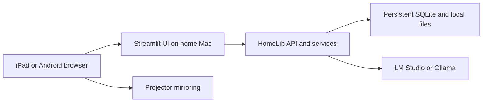
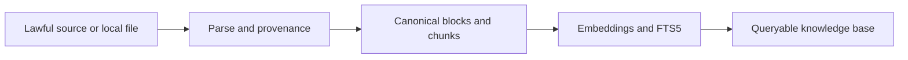

# HomeLib — improved product and build plan v2

**Status:** proposed consolidated source of truth  
**Updated:** 2026-09-01  
**Capstone deadline:** 2026-09-08 01:00 — confirm and record the cohort platform timezone  
**Product direction:** universal, local-first magical library with a public Streamlit showcase and a persistent self-hosted edition

---

## 0. Executive decision

HomeLib is not a single-purpose career-roadmap generator. It is a universal personal knowledge library in which a user can create Areas and Wings, add lawful content, search exact passages or ideas, ask a cited AI Mentor, build paths and playlists, and read or listen through a fantasy-inspired interface.

The capstone ships two configurations from one codebase:

1. **Public showcase demo:** Streamlit Community Cloud, an app-owner cloud model, a bounded lawful seed corpus, resettable/session-isolated user state, no BYOK and no arbitrary uploads.
2. **Home edition:** self-hosted Streamlit/FastAPI, persistent SQLite, local files, LM Studio as the preferred Mac runtime, Ollama as a reviewer/Linux alternative, and optional BYOK through an OpenAI-compatible endpoint.

The iPad or Android phone is the client and casting controller. It opens the Streamlit page, controls the reader and audio, and mirrors the screen to the projector. The model and SQLite database run on the Streamlit server, normally the Mac mini at home.

Apple Foundation Models are a later optional provider. They must not delay the capstone.

Commercially, the public capstone is the **Community Showcase** and acquisition funnel. **Owner 2026-09-01 evening (supersedes the two-repo split):** one Forgejo repo (`elgrassa/homelib`) until the public GitHub snapshot is submitted; paid/Home/Pro features then land in that same Forgejo copy after it is made private. Do not commit premium implementations, signing keys, or proprietary assets before `just publish`. See ADR-010.

### Success statement

> A user can ask for a topic or goal, watch the library reveal a relevant Wing, inspect cited material, accept or manually assemble a Coffee Table reading playlist, find and open an exact scene, and continue reading on a large projected two-page view. The same RAG application works as a resettable cloud demonstration and as a private persistent home library.

---

## 1. Product problem

People accumulate books, documents and recommendations, but their library remains difficult to use:

- they cannot search across the actual text and immediately open the cited passage;
- they do not know what to read next for a particular goal;
- recommendations disappear into chat history instead of becoming an editable plan;
- ordinary library software separates discovery, reading, notes, progress and AI assistance;
- cloud assistants require uploading private documents and rarely preserve source-level provenance;
- reading on a projector is visually unattractive and awkward to control from a sofa.

HomeLib turns a collection into an explorable, searchable and actionable knowledge space while preserving source rights, user control and local-first ownership.

---

## 2. Target users and primary journeys

### 2.1 Primary users

| Persona | Need | HomeLib response |
|---|---|---|
| Goal-directed learner | Learn a field without losing structure | Mentor proposes a cited path and Coffee Table stack |
| Personal-library owner | Search owned books by scene, phrase or idea | Exact, lexical, semantic and hybrid within-book search |
| Parent/family reader | Read books comfortably on a wall projector | iPad-controlled Projection Reading Mode and narration controls |
| Privacy-conscious self-hoster | Keep documents and conversations at home | SQLite, local embeddings and LM Studio/Ollama |
| Public demo visitor | Understand the concept without setup | Resettable Streamlit demo with seeded books and cloud LLM |

### 2.2 Universal Areas and Wings

The database and UI must not hard-code one output such as a career roadmap. Areas and Wings are user-extensible containers.

Examples:

```text
Career
└── AI Engineer
    ├── RAG
    ├── Agents
    ├── Evaluation
    ├── Portfolio projects
    └── Interview preparation

Health
└── Nutrition
    ├── Weight reduction
    ├── Meal planning
    ├── Protein
    └── Evidence and sources

Business
└── Digital products
    ├── Validation
    ├── Pricing
    ├── Distribution
    └── Launch plan
```

The LLM may suggest a new hierarchy after an intake conversation, but it never silently creates or changes an active Wing or playlist. The user reviews and accepts the proposal.

Health, career, legal and financial topics remain informational, source-cited and user-controlled. HomeLib must abstain when its indexed sources do not support an answer and must not present diagnosis, treatment, hiring or other high-impact decisions as authoritative.

---

## 3. Product principles

1. **Useful before magical:** search, citations, opening the source, playlists and progress work even if the animated room is disabled.
2. **RAG before free-form generation:** substantive claims come from retrieved, rights-eligible content. The model may explain or organize evidence; it does not invent a library.
3. **User acceptance before mutation:** proposed Wings, paths and Coffee Table stacks are drafts until accepted.
4. **Exact source navigation:** every citation and scene result resolves to a book, block and original offset.
5. **Local-first ownership:** personal documents, history and progress remain in local SQLite in the home edition.
6. **Provider independence:** cloud, LM Studio, Ollama and future Apple models use the same application-level provider contract.
7. **Lawful discovery:** no Anna's Archive, Sci-Hub, LibGen or other infringing connector. The fantasy "Forbidden Stacks" door federates lawful catalogs only.
8. **Progressive enhancement:** animation, two-page pagination and sphere particles have accessible static fallbacks.
9. **Measured quality:** retrieval and final answers are evaluated; the production approach is selected from evidence.
10. **Bounded capstone:** decorative extras never displace scored requirements.

---

## 4. Editions and deployment model

### 4.1 Edition matrix

| Capability | Public showcase demo | Home/self-hosted | Persistent cloud trial — later |
|---|---|---|---|
| Interface | Streamlit Community Cloud | Streamlit over localhost or LAN | Hosted web application |
| LLM | App-owner cloud provider | LM Studio preferred; Ollama/BYOK alternatives | Managed model and optional BYOK |
| Database | Resettable SQLite seed | Persistent mounted SQLite | Managed tenant-aware database |
| User identity | Random demo session | Single local principal; optional LAN PIN | OIDC account |
| User uploads | Disabled | Enabled with rights declaration | Quota-controlled private object storage |
| Mutable state | Session-scoped and disposable | Persistent | Persistent per user |
| Embeddings/search | Local runtime or precomputed seed | Local | Tenant-scoped managed/local service |
| Audio | One lawful preview, otherwise Coming soon | Local TTS when enabled and permitted | Paid/limited managed audio later |
| BYOK | Not offered | Supported through configuration | Later, encrypted with a real KMS |
| Source distribution | Public capstone/community code | Commercial packages from private source plus applicable notices | Hosted service source remains private |

### 4.2 Public demo rules

- Use a cloud model because it is the fastest reliable route to a public capstone demo.
- Store the app-owner key only in Streamlit secrets.
- Enforce a global daily token/cost ceiling, maximum output tokens, per-session throttling, concurrency limit, provider timeout and kill switch.
- Keep the committed seed catalog read-only.
- Generate a random `demo_session_id` in Streamlit Session State. Every mutable playlist, progress, conversation and feedback row must be scoped by this value; private writes may never use a null owner.
- Reset all mutable demo state on server restart and clean expired sessions by TTL.
- Show a visible banner: "Public showcase — changes may reset and content is limited to the demo collection."
- Disable arbitrary uploads and remote URL ingestion.
- Keep a deterministic prerecorded/cached showcase path so reviewers can still understand the product if the cloud model is temporarily unavailable.

### 4.3 Home topology

The preferred always-on host is the Mac mini; a MacBook Air can also host it. The iPad or Android device is only the browser, controller and casting source.



Network profiles:

- `local`: Streamlit binds to `127.0.0.1`.
- `lan`: Streamlit alone binds to the home LAN and requires a PIN/token or authenticated reverse proxy.
- FastAPI, SQLite and the model endpoint are not exposed to the LAN.
- When HomeLib is in Docker and LM Studio is host-native on macOS, use `http://host.docker.internal:1234/v1`.
- Host-native LM Studio is preferred on Apple silicon so it can use Metal efficiently.

Home/Pro capabilities:

- upload and index lawfully acquired or otherwise authorized personal content;
- persistent playlists, bookmarks, notes and reading/listening progress;
- full scene search across user-authorized local content;
- persistent local Mentor history and generated artifacts;
- LM Studio model discovery and selection;
- Ollama and other OpenAI-compatible runtimes as alternatives;
- fully local text-to-speech and voice-to-text where the selected runtime/device supports them;
- Projection Reading Mode controlled from iPad or Android;
- no book text, query or conversation transmitted to a cloud provider in local-only mode;
- optional LAN PIN or authenticated reverse proxy;
- backup/export and later Obsidian synchronization.

### 4.4 Reviewer Compose profile

To earn full containerization points, provide a reproducible `reviewer` profile containing:

- `ui`;
- `api`;
- `ingest` one-shot seed job;
- `ollama`;
- `model-init`.

The `mac-home` profile uses host-native LM Studio instead of the Compose model. Both profiles exercise the same `LLMProvider` contract.

### 4.5 Future Apple provider

Reserve `AppleFoundationProvider` in the provider registry but keep it disabled and documented as Coming soon. A future Mac-hosted edition can call Apple Foundation Models locally; a pure Streamlit page opened in iPad Safari cannot directly call the iPad's model. A native iPad wrapper/app would be required for on-iPad inference.

### 4.6 Public-repository and commercial-product boundary

The submission must be public, but a public repository is not automatically open source. GitHub explains that an explicit license is required to grant general rights to use, change and distribute code; GitHub's own terms nevertheless allow other users to view and fork a public repository through GitHub. Public forks also remain public if the original repository is later made private. Therefore, technical secrecy must come from **never publishing premium source**, not from trying to retract it later.

**Owner 2026-09-01 evening — the two-tree diagram below is historical.** There is no second git remote this week. One Forgejo repo until public GitHub; paid-tier features land in that same Forgejo copy after it is private (ADR-010). The left-hand list is still the public snapshot; the right-hand list is the post-publish paid tier, not `homelib-commercial-private`.

Recommended feature split (public snapshot vs later paid tier, same Forgejo repo):

```text
homelib-capstone-public
├── lawful seed corpus and fixtures
├── ingestion, SQLite, RAG and evaluation core
├── basic Mentor, Coffee Table and reader
├── public Streamlit demo
├── reviewer Docker Compose profile
├── tests, documentation and monitoring
└── one audio/projection preview

homelib-commercial-private
├── Home/Pro packaging and installers
├── polished rotunda and premium visual assets
├── arbitrary personal-library ingestion and OCR hardening
├── production local TTS/STT and Silver Memory pipeline
├── LM Studio discovery and model-management UX
├── household profiles, LAN security and backups
├── Obsidian/native Apple integrations
├── licence/entitlement verification and update channel
└── commercial support and migration tooling
```

The public repository must still be a genuine, reproducible project that satisfies the course rubric. Premium separation may not remove the scored RAG, evaluation, monitoring, ingestion or Compose implementation.

Licensing decision before public push:

- Do **not** accidentally add MIT, Apache-2.0 or another permissive license if commercial copying is a concern.
- `AGPL` requires source-sharing for networked modifications but does not prevent another party from selling a compliant fork.
- `BUSL-1.1` is source-available and normally permits non-production use, but requires a future change to an open-source licence; use it only if that conversion is intentional.
- A standardized noncommercial source-available licence such as PolyForm Noncommercial can allow study, educational review and personal experimentation while withholding commercial rights.
- The strongest-control alternative is an all-rights-reserved repository with a narrowly drafted capstone evaluation permission, but custom terms should receive legal review.

**Provisional recommendation:** use a recognized source-available noncommercial licence for the public capstone and sell a separate commercial licence for Home/Pro. Have the exact licence text reviewed before commercial launch. Preserve third-party licence notices and run an automated dependency-licence/SBOM check; the HomeLib licence cannot override dependency obligations.

For a fully offline paid product, entitlement checks should use a locally verified, signed licence file. The app embeds only the public verification key; the signing key never ships. Online activation, telemetry and a permanent licence server must not be required for the "fully private" claim. This deters casual copying but cannot make customer-delivered software impossible to reverse engineer. Long-term defensibility comes from brand, UX, signed releases, updates, support, integrations and trustworthy privacy—not obfuscation alone.

The public Streamlit application is a **showcase and lead-generation surface**, not guaranteed free advertising. It may include a restrained "Home/Pro — fully private self-hosted edition" panel linking to an external landing page or waitlist, subject to Streamlit's current terms. Do not place checkout secrets or premium code in the demo.

---

## 5. Signature product experience

### 5.1 Information architecture

Primary destinations:

- **Library Crossroads / Explore:** rotating room of Areas and Wings.
- **My Shelf:** owned and indexed content.
- **Discover:** lawful external catalogs and public-domain sources.
- **Coffee Table:** current AI-proposed and manually curated playlist.
- **Mentor Journal:** cited conversation, intake and generated artifacts.
- **Roadmaps:** accepted learning, reading or action paths.
- **History:** continue from the last book, scene, conversation or audio position.
- **Observatory:** quality, feedback and system behavior.

`MY SHELF` and `DISCOVER` must remain visually and semantically distinct. A source discovered in a catalog is not represented as owned or locally readable until lawful full text is imported.

### 5.2 Library Crossroads and rotating room

The room presents five door positions:

1. central active door;
2. near-left;
3. near-right;
4. partially hidden far-left;
5. partially hidden far-right.

Rotation wraps indefinitely. Doors leaving one border re-enter from the other, allowing an arbitrary number of Areas and Wings without redesigning the room.

Required behavior:

- drag/swipe, arrow buttons and keyboard navigation rotate the room;
- clicking a side door rotates it to the center before entry;
- a typed topic can reveal or rotate toward the most relevant existing Wing;
- if no Wing is suitable, the Mentor proposes a new Area/Wing structure for approval;
- URL/state identifies the active Area and Wing so refresh and back navigation work;
- reduced-motion mode replaces rotation with cross-fades;
- a normal accessible door list/grid appears below or instead of the custom component.

### 5.3 Explore flow

1. User enters a topic or chooses a visible door.
2. Local retrieval checks existing shelf content and Wings.
3. The LLM classifies intent and may rewrite the query.
4. The room rotates to the best Wing or presents a proposed Wing.
5. The Wing screen shows shelf results, catalog discoveries and two clear actions:
   - **Ask this Wing**;
   - **Build a reading path**.
6. Recommendations remain a proposal until the user accepts all or selected items onto the Coffee Table.

### 5.4 Wing and shelf screen

Each Wing shows:

- a concise explanation of its scope;
- locally available resources first;
- discovered catalog resources separately;
- filters for author, source, language, year, format, content type, rights status, full-text availability and reading status;
- unique result count, approximate-provider counts marked with `~`, and active filter count;
- search modes: Exact, Keyword, Semantic, Smart and Ask;
- actions: open, inspect source, ask, add to Coffee Table, save metadata, or import lawful full text.

### 5.5 Mentor Journal

The Mentor behaves like an enchanted conversational journal without copying a named franchise or its visual assets.

It supports:

- text intake and later optional voice input;
- source-cited answers;
- follow-up questions grounded in conversation plus retrieved evidence;
- generated typed artifacts: reading path, career learning path, project plan, study checklist, meal-planning information or other domain-specific structure;
- abstention and request-for-more-sources when evidence is missing;
- proposed Coffee Table stack with explicit acceptance controls.

The conversation is not itself the final product. Useful outputs become named, versioned artifacts that can be saved, edited and revisited.

### 5.6 Coffee Table

The Coffee Table is a persistent, ordered playlist—not a transient recommendation panel.

Items can be added:

- from an AI Mentor proposal;
- manually from My Shelf;
- manually from Discover/search;
- from a saved roadmap.

Rules:

- AI proposals require acceptance as a whole or per item;
- manual additions are never removed by later regeneration;
- user ordering survives Mentor updates;
- statuses: proposed, queued, reading, listening, paused, completed, skipped, removed;
- reading and listening progress are stored separately;
- a completed or deliberately removed item is not silently reinserted;
- removing an item does not delete the resource;
- the table remembers the last-opened item and position after restart in the home edition.

### 5.7 Smart Scene Search

Within a book, the user may ask:

- an exact quotation;
- a remembered phrase with imperfect wording;
- a character/event description;
- a discussed topic;
- "open the scene where ...";
- a question requiring explanation of a passage.

Modes:

| Mode | Method | LLM required? |
|---|---|---:|
| Exact | normalized phrase match with original offsets | No |
| Keyword | SQLite FTS5/BM25 | No |
| Semantic | vector similarity | No |
| Smart | hybrid fusion and optional rerank | No |
| Ask | Smart retrieval followed by cited synthesis | Yes |

Every result includes `resource_id`, `chapter_id`, `block_id`, original character offsets, a quote, previous/next context and an `open_anchor`. Normalization must maintain a map back to original text offsets. A chapter- or book-scoped query may never leak results from another scope after rewriting.

### 5.8 Book reader

The normal reader provides:

- single-page responsive reading;
- chapter drawer;
- breadcrumbs and source/provenance panel;
- exact highlighted citations;
- bookmarks and notes;
- Ask about this passage;
- Summarize chapter;
- Start Mentor session;
- Add/return to Coffee Table;
- progress saved per reading session.

### 5.9 Projection Reading Mode

Projection mode is a first-class experience for an iPad/Android browser mirrored to a wall projector.

Required behavior:

- explicit **Enter projector mode** control;
- 16:9 presentation stage with one- or two-page layout;
- two-page spread on suitable landscape viewports and one-page fallback;
- large scalable typography and high contrast;
- Streamlit development chrome and ordinary navigation hidden;
- large touch targets for next/previous and play/pause;
- swipe and keyboard navigation;
- optional family mode hiding technical controls;
- anchors survive font-size and pagination changes;
- progress survives browser reconnection in self-hosted mode;
- the same page and audio controls work when screen mirrored or connected by HDMI.

Do not rely only on viewport width to detect a projector. The user explicitly selects projector mode because screen mirroring may report iPad dimensions rather than the projected surface.

### 5.10 Book-to-audio and Memory Sphere

Product metaphor:

```text
Book → Silver Memory → Memory Sphere → listening progress
```

- A Silver Memory is a prepared narration artifact for a rights-eligible passage or book.
- The Memory Sphere is the player and state visualization.
- One deliberate tap starts or pauses playback; this also satisfies browser audio gesture requirements.
- Fine dust/particles appear only while audio is actually playing.
- Reader and projector controls share one playback state.
- Audio generation is allowed only when `can_generate_audio=true`.

Capstone scope: ship one bundled public-domain audio preview and mark full generation **Coming soon**. Full local TTS, caching, chapter assembly and voice selection are post-capstone unless every rubric gate is already green.

Speech responsibilities are separate from the generative LLM:

- the LLM performs Mentor reasoning, query rewriting, summarization and structured path generation;
- a TTS provider turns rights-eligible text into narration;
- an STT provider turns microphone audio into Mentor input;
- the reader/audio service owns playback, offsets, caching and progress.

Provider options for Home/Pro:

- native Apple app: Apple Speech framework/SpeechAnalyzer for transcription and AVSpeechSynthesizer or an approved local voice provider for speech synthesis;
- Mac-hosted Streamlit: a local Whisper-compatible STT runtime plus a local TTS runtime, or a small native Apple helper in a later release;
- cloud demo: no microphone and only one bundled audio preview, avoiding browser permissions, cost and privacy ambiguity.

Do not describe TTS or STT as a Foundation Models capability. Apple Foundation Models may generate or interpret text, while Apple's speech APIs perform transcription and synthesis.

### 5.11 Forbidden Stacks

The fantasy-styled discovery door replaces the rejected Anna's Archive idea. It searches lawful providers while retaining mysterious visual language.

Initial providers:

- Open Library for catalog metadata;
- Standard Ebooks for curated public-domain editions;
- Project Gutenberg/Gutendex for public-domain text and metadata.

Later candidates include DOAB, OpenAlex, Europe PMC, arXiv and LibriVox, each behind a connector and rights policy.

The UI shows:

- unique works count;
- per-provider counts and whether they are approximate;
- source attribution;
- full-text availability;
- language, year, format and license filters;
- duplicate-provider badges without double-counting a work;
- "Open lawful source" rather than downloading through HomeLib when redistribution is not permitted.

---

## 6. Data and rights model

### 6.1 Capstone datasets

- Public-domain full-text snapshot: 18 books, 729 blocks and approximately 9,168 stable chunks from the verified v1 corpus.
- Open Library curated catalog snapshot: approximately 3,061 records.
- Retrieval ground truth: 235 question-to-chunk mappings, reusable only if the v1 chunk identifiers remain unchanged.
- One clearly licensed/public-domain audio preview.

The DataTalks.Club course FAQ corpus is prohibited and must not be used.

### 6.2 Rights manifest

Every bundled or imported resource records:

```text
source
source_url
title
author
edition
retrieved_at
content_hash
license
license_url
rights_status
decision_basis
can_index_text
can_generate_audio
can_bundle_demo
```

Unknown rights fail closed:

- metadata may be searchable as metadata;
- unknown-rights full text does not enter RAG;
- audio is not generated;
- UI explains the restriction rather than silently omitting the item.

### 6.3 Deduplication

Merge candidate order:

1. DOI;
2. ISBN/edition identifier;
3. provider-confirmed mapping;
4. normalized title + author + year;
5. otherwise retain separate records.

All source attributions survive a merge. Ambiguous matches are never silently combined.

---

## 7. Technical architecture

### 7.1 One service layer, two clients

Streamlit Community Cloud runs one Streamlit process, so the demo uses an in-process client. The self-hosted UI uses FastAPI.

```text
HomelibClient
├── InProcessClient → shared application service layer
└── HttpClient      → FastAPI → same application service layer
```

The UI may not import SQLite, parsers or model-provider implementations directly. An AST boundary test enforces this rule.

A parametrized conformance suite runs identical behavior tests against `InProcessClient` and `HttpClient`, preventing the two editions from diverging.

### 7.2 Provider contract

```python
class LLMProvider(Protocol):
    def generate(self, request: GenerationRequest) -> GenerationResult: ...
    def stream(self, request: GenerationRequest) -> Iterator[GenerationDelta]: ...
    def health(self) -> ProviderHealth: ...
    def supports_tools(self) -> bool: ...
    def supports_structured_output(self) -> bool: ...
```

Implementations:

- `ManagedCloudProvider` for the public demo;
- `OpenAICompatibleProvider` for LM Studio, Ollama and BYOK;
- `AppleFoundationProvider` reserved for later.

Suggested configuration:

```env
APP_MODE=demo|selfhosted
LLM_MODE=managed|openai_compatible|apple_future
LLM_BASE_URL=
LLM_MODEL=
LLM_TIMEOUT_SECONDS=90
LLM_MAX_OUTPUT_TOKENS=800
```

Keys live only in environment/secrets. Health responses expose provider/model/reachability booleans but never key material.

### 7.3 Other interchangeability seams

- `UserRepository`: demo-session principal or local-user principal; OIDC later.
- `DocumentStore`: local filesystem shaped as `users/{principal}/{resource_id}`; object storage later.
- `EntitlementProvider`: edition feature matrix now; quotas/licensing later.
- `AudioProvider`: bundled preview now; local or managed TTS later.

### 7.4 SQLite

Use WAL mode, foreign keys, busy timeout, schema migrations and one transaction per user action.

Core tables:

```text
users/demo_sessions
areas
wings
resources
resource_sources
documents
blocks
chunks
chunks_fts
embeddings
bookmarks
notes
playlists
playlist_items
progress_events
reading_sessions
conversations
conversation_messages
artifacts
citations
searches
query_events
feedback
audio_assets
audio_progress
schema_migrations
```

Shared demo catalog rows are read-only. Every private/mutable row has a non-null principal identifier.

### 7.5 Embeddings

- Use `all-MiniLM-L6-v2` or its measured ONNX equivalent for the capstone.
- Store vectors as float32 BLOBs with model name, dimension and index revision.
- The approximately 9,168 × 384 seed matrix is small enough to cache in memory.
- Do not decode all vector BLOBs for every query; cache a contiguous matrix keyed by index revision.
- Cloud seed embeddings are precomputed. Only the query embedder must load at runtime.
- Measure Community Cloud memory with the actual runtime before the main UI is built.

### 7.6 Ingestion

Pipeline:



Supported capstone formats: EPUB, native PDF, TXT and Markdown. OCR PDF and DjVu are optional/post-capstone unless already verified from v1.

Use dlt with a SQLite destination. Runs are idempotent and use staging-to-canonical loading. A second identical run inserts zero duplicates.

### 7.7 RAG and agent flow

1. Validate query and scope.
2. Classify intent and optionally rewrite the query.
3. Run lexical and vector retrieval.
4. Fuse with reciprocal-rank fusion.
5. Optionally rerank; preserve original order if the reranker fails.
6. Apply rights, user and book/chapter scope before context construction.
7. Give the LLM only a compact set of cited passages.
8. Permit bounded tool calls such as `search_library`, `get_block`, `get_resource`, `propose_playlist` and `build_path`.
9. Parse a typed response; allow one bounded repair attempt.
10. Resolve every citation before returning the answer.
11. Log latency, retrieval mode, provider, prompt version and feedback linkage.

Search remains functional when the LLM is offline. LLM or vector failure produces an explicit degraded response rather than a fabricated success.

---

## 8. API contracts

FastAPI remains the reviewer-facing contract even though the cloud demo calls the service layer in process.

Minimum endpoints:

| Endpoint | Purpose |
|---|---|
| `GET /health` | Provider reachability, index revision and counts without secrets |
| `POST /v1/search` | Exact/keyword/semantic/smart search |
| `POST /v1/ask` | Grounded cited answer |
| `POST /v1/mentor/intake` | Analyze goal and propose Area/Wing/path |
| `POST /v1/paths` | Create accepted typed path artifact |
| `GET/POST /v1/areas` | List/create Areas |
| `GET/POST /v1/wings` | List/create Wings |
| `GET /v1/resources` | Shelf and discovery resources |
| `POST /v1/resources/{id}/search` | Smart Scene Search within a book |
| `GET /v1/blocks/{id}` | Resolve citation/open anchor |
| `GET/POST /v1/playlists/current` | Coffee Table state |
| `POST/PATCH/DELETE /v1/playlists/current/items` | Accept, add, reorder and remove items |
| `POST /v1/progress` | Reading/listening progress event |
| `POST /v1/bookmarks` | Bookmark exact source location |
| `POST /v1/feedback` | Thumbs and optional comment |
| `GET /v1/observatory` | Monitoring aggregates |
| `GET /v1/audio/capabilities` | Edition and rights-aware audio availability |

Public request models reject unknown fields. Provider source payloads are preserved explicitly under `raw_json`. Every LLM output is typed. Commit an OpenAPI snapshot and fail CI on accidental contract drift.

---

## 9. Evaluation and monitoring

### 9.1 Retrieval evaluation

Evaluate at least:

- lexical FTS5;
- vector;
- hybrid RRF;
- hybrid + rerank;
- rewrite on/off where time permits.

Metrics:

- hit rate at 5;
- MRR at 5;
- per-book breakdown;
- scene-search exact-offset accuracy;
- book/chapter scope-leak count;
- p50/p95 within-book latency.

Use the best measured arm in production and document the decision in an ADR. Do not turn rewriting on simply to claim the point if evaluation shows it degrades quality.

### 9.2 LLM evaluation

Compare at least three prompt/flow variants on:

- faithfulness to retrieved passages;
- relevance;
- citation correctness;
- appropriate abstention;
- completeness without unsupported expansion;
- typed-output validity.

Use a judge prompt with explicit bias controls and publish sub-scores. Maintain a prompt hash and a regression baseline with human notes.

### 9.3 Observatory

Collect feedback and show at least five populated charts:

1. queries over time;
2. p50/p95 latency;
3. retrieval-mode usage;
4. positive/negative feedback ratio;
5. degraded/no-result rate;
6. connector failures;
7. optional token/cost estimate.

Default logs store a query hash rather than raw personal text. The public demo may log only normalized operational metadata and explicit feedback.

---

## 10. Security, privacy and reliability

- No secrets in SQLite, logs, health endpoints, fixtures or screenshots.
- Run secret scanning in CI and before publishing.
- Personal books and generated audio are ignored by Git.
- The demo does not accept file paths, uploads or arbitrary remote URLs.
- Local path ingestion resolves and validates paths beneath the configured library root.
- Rights and tenant/principal filters are applied before retrieval, not after generation.
- LAN mode requires an explicit opt-in and access control.
- Only the Streamlit port is exposed to the home LAN.
- Provider calls have bounded retries, timeouts and output sizes.
- Tool calls use an allowlist and typed arguments.
- Mutating Mentor tools create proposals unless the user explicitly confirms the operation.
- A degraded model/reranker/connector never persists placeholder output as a real artifact.
- Backup/export design must include SQLite, document manifest and user-generated artifacts without provider keys.

---

## 11. Capstone rubric plan

| Criterion | Target | Evidence |
|---|---:|---|
| Problem description | 2/2 | README problem, personas and end-to-end journeys |
| Retrieval flow | 2/2 | SQLite knowledge base + LLM + resolvable citations |
| Retrieval evaluation | 2/2 | Multiple arms, metrics table, winner ADR |
| LLM evaluation | 2/2 | Three approaches, judge results, chosen winner |
| Interface | 2/2 | Public Streamlit UI and FastAPI contract |
| Ingestion pipeline | 2/2 | Automated dlt-to-SQLite pipeline |
| Monitoring | 2/2 | Feedback plus Observatory with at least five populated charts |
| Containerization | 2/2 | Complete reviewer Docker Compose profile |
| Reproducibility | 2/2 | Accessible seed, pinned dependencies, cold-clone drill |
| Hybrid search | 1/1 | FTS5 + vector + RRF evaluation |
| Reranking | 1/1 | Evaluated cross-encoder with fail-open degradation |
| Query rewriting | 1/1 | Evaluated on/off and used if justified |
| Cloud deployment | 2/2 | Logged-out public Streamlit URL |
| Extra | discretionary | Scene anchors, projection UX, eval regression gate, lawful federation |

Base target: **21/21**. Cloud target: **23/23 before discretionary extras**. Three peer reviews are scheduled after submission.

Documentation must explain the project to someone who did not take the course and include setup, architecture, data/rights, evaluation, monitoring, screenshots, example inputs/outputs, a short walkthrough video, public URL and exact submitted commit hash.

---

## 12. Delivery plan

### 12.1 Safety track

- Preserve the verified v1 commit as an immutable fallback tag and record its hash.
- Confirm in writing that fallback submission is eligible under the course's no-reuse rule.
- Build v2 on a separate integration branch.
- Never merge v2 into the fallback branch until the v2 cold-clone drill is green.

### 12.2 Corrected calendar

| Date | Delivery | Gate |
|---|---|---|
| Tue Sep 1 evening | Freeze this plan, tag fallback, scaffold repo/branch, minimal UI and Compose skeleton | Product/edition contradictions resolved |
| Wed Sep 2 | Specs, migrations, seed, demo-session isolation, Streamlit Cloud canary | Public canary loads; SQLite tests green |
| Thu Sep 3 | Ingestion, FTS/vector indexes, cache and initial retrieval evaluation | Idempotent ingest; ≥4 measured retrieval arms |
| Fri Sep 4 | Mentor tools, cited answer, connectors and Scene Search; thin end-to-end UI | One goal → cited proposal → exact open anchor |
| Sat Sep 5 | Coffee Table, reader, progress and monitoring instrumentation; first drill | Scope-cut checkpoint at 18:00 |
| Sun Sep 6 | Rotunda/static fallback, projection mode, Observatory charts, reviewer Compose hardening | Final v2 GO/NO-GO at 18:00 |
| Mon Sep 7 | Evaluation evidence, docs, screenshots/video, deployment, clean-machine drill and submission | Public URL and submitted hash verified |
| Tue Sep 8 01:00 | Deadline | Timezone already confirmed; no last-minute build |

The cloud canary must be deployed by Sep 2, not for the first time on submission day. It verifies dependency installation, secret configuration, memory, seed loading and one real provider call.

### 12.3 Work packages

#### WP00 — Freeze, fallback and canary

- Commit this product plan as `specs/product.md`.
- Tag and record fallback commit.
- Create public-deployment branch/repository surface early.
- Scaffold Streamlit, provider configuration and reviewer Compose.
- Deploy canary with one seeded search and cloud-model health check.
- Pin and smoke-test one Ollama reviewer model and one LM Studio home model configuration.
- Freeze the public/private feature boundary and choose a provisional public-repository licence before the first public push.
- Confirm that no premium source, signing key, private book, proprietary visual asset or commercial entitlement code exists in public history.

#### WP01 — Contracts and acceptance tests

- Write concise specs for schema, ingestion, retrieval, scene search, rights, connectors, Mentor, Coffee Table, progress, provider seam, client seam, rotunda, projection mode, audio preview, Observatory and evaluation.
- Name red tests and verify commands before implementation.
- Commit OpenAPI snapshot.

#### WP02 — SQLite and principals

- Implement migrations and repositories.
- Build deterministic logical seed with counts/checksums.
- Implement `demo_session_id` and `local-user` principals.
- Verify FK, idempotency, restart persistence and demo reset.

Do not require byte-for-byte equality of independently generated SQLite files. Verify canonical row counts and logical checksums; optionally produce a stable distribution artifact with a controlled build process.

#### WP03 — Ingestion and rights

- Port verified parsers/chunker.
- Load through dlt to SQLite.
- Preserve stable v1 chunk IDs.
- Enforce rights before indexing.
- Run twice and assert no duplicates.

#### WP04 — Retrieval and evaluation

- FTS5, vector cache, RRF, optional reranker and rewrite.
- Run the frozen 235-question evaluation.
- Add a separate scene-search evaluation set.
- Decide ONNX/runtime memory strategy using the deployed canary.

#### WP05 — Lawful connectors

- Open Library, Standard Ebooks and Gutenberg fixture adapters.
- One live smoke per enabled provider outside CI.
- Rights normalization, deduplication, caching and degradation.
- Ship live Open Library first; other live providers may fall back to fixtures.

#### WP06 — Mentor and artifacts

- Tool loop and typed outputs.
- Cited answers and abstention.
- Goal intake and proposed Area/Wing/path.
- Proposed Coffee Table stack requiring acceptance.
- High-stakes informational notice where appropriate.

#### WP07 — Coffee Table and progress

- AI proposal acceptance, manual add, reorder and removal.
- Independent read/listen progress.
- Restart persistence.
- Completed/skipped item protection from silent reinsertion.

#### WP08 — Streamlit vertical experience

- Crossroads with static accessible doors first.
- Wing, shelf, Mentor, Coffee Table and reader screens.
- Connect every screen to a real service call before animation polish.
- Parametrized parity tests for in-process and HTTP clients.

#### WP09 — Projection and fantasy enhancement

- One-page projection first, then two-page if stable.
- iPad and Android landscape tests.
- Rotating-room component only after fallback navigation works.
- One lawful Memory Sphere preview.

#### WP10 — Observatory

- Query/feedback logging begins in earlier service WPs.
- Build aggregates and at least five populated charts.
- Generate demo traffic and verify feedback UI→service→database.

#### WP11 — Reproducibility and submission

- Reviewer Compose all healthy.
- Mac-home LM Studio profile documented.
- LAN/iPad instructions and security warning.
- Cold-clone drill including cited answer, exact scene anchor, Coffee Table restart and chart data.
- README, evaluation/data/rights/setup/usage/course-map/rubric self-audit.
- Public demo, video, screenshots, exact commit and final secret/licence scan.
- Add a clear Community Showcase versus Home/Pro comparison and a non-intrusive landing-page/waitlist link.
- Generate third-party notices/SBOM and verify the repository licence is compatible with bundled dependencies and assets.

### 12.4 GO/NO-GO definition

V2 proceeds only if, by Sun Sep 6 18:00:

- public demo loads logged out;
- one cited RAG answer resolves every citation;
- multiple retrieval approaches and multiple LLM approaches have committed results;
- dlt ingestion is repeatable;
- feedback and at least five charts work;
- reviewer Compose is healthy;
- a clean drill is plausible to complete Monday;
- no unresolved rights, secret or cross-session isolation blocker exists.

Otherwise submit the eligible verified fallback and continue v2 afterward.

---

## 13. Cut order

Cut in this order:

1. standalone single-file HTML prototype;
2. Memory Sphere particles and polish;
3. two-page projection, retaining one-page mode;
4. custom rotating-room component, retaining static door grid/list;
5. live Standard Ebooks/Gutenberg connectors, retaining fixtures and live Open Library;
6. full audio generation, retaining one preview;
7. rewrite in production if evaluation does not justify it.

Never cut:

- cited knowledge-base + LLM flow;
- multiple retrieval and LLM evaluations;
- automated ingestion;
- user feedback plus five populated monitoring charts;
- reviewer Compose;
- reproducible seed and clean drill;
- rights fail-closed behavior;
- cross-session demo isolation;
- cloud deployment and reviewer documentation.

---

## 14. Acceptance journeys

### Journey A — public reviewer

1. Open public URL without login.
2. Search "AI agent evaluation".
3. Enter a Wing and ask a question.
4. Receive a cited answer and open the cited passage.
5. Request a path and accept selected books onto the Coffee Table.
6. Give feedback.
7. Open Observatory and see populated charts.

### Journey B — manual playlist

1. Open a shelf or search result.
2. Add a book manually to Coffee Table.
3. Reorder it ahead of an AI-suggested book.
4. Regenerate Mentor recommendations.
5. Confirm the manual item and user order remain unchanged.

### Journey C — scene search

1. Open a book.
2. Enter an imperfect recollection of a scene.
3. Smart Search returns the relevant passage.
4. Select it and open the correct exact anchor with surrounding context.
5. Ask the Mentor to explain the scene using citations from that book only.

### Journey D — home projector

1. Start HomeLib on the Mac mini with the `mac-home` profile and LM Studio.
2. Open the LAN Streamlit URL on iPad or Android.
3. Mirror the device to the projector.
4. Enter projector mode and open a Coffee Table book.
5. Navigate pages from the sofa.
6. Tap the sphere to start/pause the lawful audio preview.
7. Reconnect the browser and confirm reading progress persists.

### Journey E — degraded operation

1. Stop the LLM provider.
2. Exact, keyword, semantic and Smart search still work.
3. Ask/Mentor reports an explicit degraded state rather than inventing an answer.
4. Existing books, bookmarks, playlist and progress remain usable.

---

## 15. Post-capstone roadmap

### Phase 1 — home product hardening

- LM Studio model discovery and selector;
- local TTS with rights-aware generation;
- full Silver Memory lifecycle and audio cache;
- voice-to-text Mentor input;
- backups and export/import bundle;
- multiple household profiles and optional LAN authentication;
- Obsidian export and optional two-way integration;
- OCR/DjVu re-enable.

#### Obsidian integration design

Start with an export contract before building a plugin:

1. Export one Markdown note per resource with stable frontmatter (`homelib_resource_id`, title, authors, rights/source, Wing, status and progress).
2. Export cited Mentor artifacts, bookmarks and reading notes using stable block anchors rather than copying unnecessary full text.
3. Write atomically into a user-selected vault subfolder and never overwrite an externally changed note without conflict detection.
4. Provide an Obsidian URI/deep link to open the generated note.

Then add an optional HomeLib Obsidian plugin:

- the plugin talks to a loopback/LAN HomeLib API using a user-created scoped token;
- commands: search HomeLib, insert cited passage, add current note/resource to Coffee Table, open resource in HomeLib, sync progress and create a Mentor artifact;
- use Obsidian's official Vault API and `Vault.process()` for safe note changes;
- use Obsidian SecretStorage for API tokens;
- no telemetry and no implicit indexing of the entire vault;
- each vault/folder is opt-in and has explicit read/write permissions;
- mobile support is a separate acceptance lane because Obsidian mobile plugins cannot assume desktop Node filesystem APIs.

Do not make a third-party "Local REST API" community plugin a mandatory dependency. HomeLib should expose its own documented, scoped API and the official HomeLib plugin should call it.

### Phase 2 — persistent cloud trial

- OIDC authentication;
- managed Postgres with verified `user_id` scoping/RLS;
- private object storage under `users/{user_id}/...`;
- quotas for pages, LLM requests, playlists and audio minutes;
- cloud↔self-host export/import;
- encrypted BYOK with KMS;
- retention and account deletion controls.

### Phase 3 — native Apple companion

- native iPad/Mac shell or application;
- Apple Foundation Models provider;
- local SQLite and local embedding model on supported devices;
- native speech recognition and speech synthesis;
- AirPlay-first projector controls;
- offline family reading mode.

### Phase 4 — richer lawful federation

- DOAB, OpenAlex, Europe PMC, arXiv and LibriVox;
- provider health and freshness monitoring;
- source-specific license policies;
- cross-provider edition graph and improved deduplication.

---

## 16. Final definition of done

HomeLib v2 is done for the capstone only when:

- a stranger can understand the problem and architecture from the README;
- the public Streamlit demo works without credentials;
- demo mutable state cannot leak between sessions;
- the application retrieves from a real knowledge base and produces grounded citations;
- multiple retrieval and LLM approaches were measured and the selected variants are documented;
- dlt automates ingestion;
- feedback and a five-chart Observatory are demonstrated;
- the complete reviewer runtime starts through Docker Compose;
- the home LM Studio topology and iPad/projector path are documented and manually tested;
- dependency versions, corpus access and run commands are reproducible;
- rights decisions and bundled-source licenses are explicit;
- the submitted commit passes the cold-clone drill;
- the public/community boundary and repository licence are explicit, and no premium/private material appears in Git history;
- the repository URL, public application URL, commit hash and submission timestamp are recorded;
- three peer reviews are scheduled/completed according to cohort rules.

The magical room is HomeLib's signature. The reliable, cited, rights-aware and provider-independent knowledge workflow is the product underneath it.

---

## 17. Authoritative implementation references

- DataTalksClub LLM Zoomcamp capstone requirements: <https://github.com/DataTalksClub/llm-zoomcamp/blob/main/project.md>
- GitHub repository licensing: <https://docs.github.com/articles/licensing-a-repository>
- GitHub public-repository rights and terms: <https://docs.github.com/site-policy/github-terms/github-terms-of-service>
- GitHub warning about public forks after visibility changes: <https://docs.github.com/repositories/managing-your-repositorys-settings-and-features/managing-repository-settings/setting-repository-visibility>
- PolyForm standardized source-available licences: <https://polyformproject.org/licenses>
- MariaDB Business Source License 1.1: <https://mariadb.com/bsl11/>
- Streamlit Community Cloud public sharing: <https://docs.streamlit.io/deploy/streamlit-community-cloud/share-your-app>
- Apple speech recognition framework: <https://developer.apple.com/documentation/speech>
- Apple speech synthesis: <https://developer.apple.com/documentation/avfoundation/speech-synthesis>
- Obsidian Vault API: <https://docs.obsidian.md/Plugins/Vault>
- Obsidian SecretStorage: <https://docs.obsidian.md/plugins/guides/secret-storage>

Before commercial release, re-check current platform terms and obtain legal review of the chosen software licence, third-party dependency obligations, privacy claims and bundled-content rights.

---

## Commercial split and product ladder (owner 2026-09-01; evening pivot)

This section restates the owner boundary that arrived after the consolidated plan freeze, then the **evening pivot**: one Forgejo repo until public GitHub; paid tier in the same repo after Forgejo is private. `docs/plan-v2.md` stays verbatim (it still mentions `homelib-commercial-private` in §9). Engineering dates and verification remain in that file. Licence: ADR-007. Sequence: ADR-010.

### Paid Home/Pro — same Forgejo repo after public GitHub; not this week

Do not implement these in the public snapshot. Do not create their tables in the public schema except as Coming-soon stubs. After the submitted hash is frozen and Forgejo is private, they may land **in this same repo**:

- arbitrary personal-book ingestion
- hardened EPUB/PDF/OCR pipelines
- persistent private conversations and artifacts (beyond the demo-session / single-principal capstone paths)
- LM Studio discovery and model-management interface
- production local TTS/STT
- Silver Memory generation
- polished sphere and rotunda assets
- household profiles and LAN authentication
- backup, restore and migration
- Obsidian plugin
- native Apple companion
- installers, signed releases and automatic updates
- offline commercial licence verification

### Public app this week — restrained showcase copy

The public application is a product showcase, not the paid product:

> HomeLib Home — fully private self-hosted library
> Local AI · Personal books · Projector reading · No cloud transmission

It may link to a landing page or waitlist. Streamlit Community Cloud is a showcase, not guaranteed free advertising.

### Protecting the product

A public GitHub repository is not automatically open source. An explicit licence is required; GitHub terms still allow view and fork; public forks stay public if the origin is later made private. Never commit premium code, signing keys, or proprietary visual assets **before** `just publish`. Never casually select MIT or Apache-2.0. Provisional public-capstone licence: PolyForm Noncommercial, subject to legal review before commercial launch. Sell a separate commercial licence for Home/Pro. After the public snapshot, distribute Home/Pro from the same Forgejo repo once it is private (signed installers or container images). For offline privacy, a signed licence file verified locally — no mandatory licence server or telemetry. Protect the HomeLib name, logo, premium artwork, and product identity separately. AGPL would not stop a compliant paid fork. BSL requires eventual OSS conversion — only if that outcome is wanted (it is not, unless the owner says so). No technical mechanism makes self-hosted software uncopyable; the moat is the complete experience.

### Product ladder

Free public showcase → paid Home/Pro in the same Forgejo repo after it is private → persistent cloud option → native Apple and Obsidian ecosystem.

### TTS / STT / Apple (post-capstone; do not ship this week)

Align with ADR-009: one lawful public-domain audio preview this week; otherwise Coming soon.

- Foundation model: Mentor reasoning, summaries, structured artifacts (later; reserved provider, not this week)
- STT: voice-to-text
- TTS: narration
- Audio service: chapters, caching, playback, progress
- Future native Apple: Speech framework + AVSpeechSynthesizer — distinct from Apple Foundation Models
- Mac-hosted Streamlit: local Whisper-compatible STT + local TTS

### Obsidian (post-capstone §15, contract-first)

- Safe Markdown export with stable HomeLib IDs + frontmatter
- Deep links
- Optional two-way plugin
- Commands: search, insert cited passages, Coffee Table, progress
- Scoped local API token via Obsidian SecretStorage
- Vault-folder opt-in, no telemetry
- Official Vault API + conflict-safe `Vault.process()`
